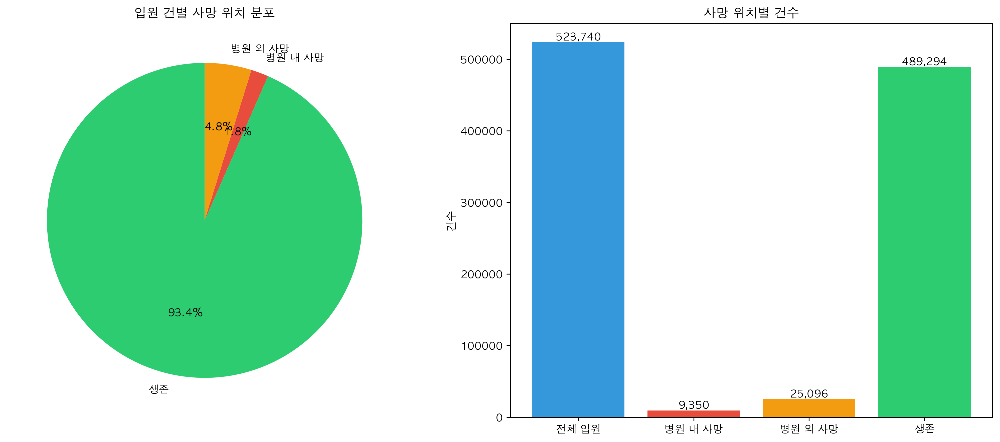
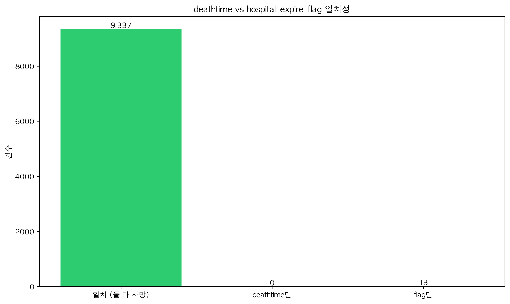

# 사망 데이터 분석

## 📌 개요
MIMIC-IV 데이터셋에서 사망 관련 정보를 체계적으로 분석합니다. 모든 테이블에서 사망 관련 필드를 찾아 데이터의 일치성을 검증하고, 병원 내/외 사망을 구분하여 통계를 제공합니다.

## 🎯 분석 목표
- 목표 1: MIMIC-IV의 모든 테이블에서 사망 관련 필드 식별
- 목표 2: 사망 데이터 간 일치성 검증 및 불일치 사례 발견
- 목표 3: 병원 내/외 사망 구분 및 통계 분석

## 📋 분석 방법론

### "사망 데이터"의 정의
본 분석에서 사망 데이터는 다음과 같이 정의됩니다:

1. **시간적 기준**: 
   - `dod` (Date of Death): 환자의 사망일
   - `deathtime`: 병원 내 사망 시각
2. **데이터 범위**: core, hosp, icu 폴더의 모든 테이블
3. **판단 기준**: 
   - 병원 내 사망: `hospital_expire_flag = 1`
   - 병원 외 사망: `hospital_expire_flag = 0` AND `dod is not null`
   - 생존: `dod is null`
4. **제외 기준**: 없음 (모든 환자 포함)

#### 구체적 예시
- 포함: 모든 입원 기록 (523,740건)
- 병원 내 사망: hospital_expire_flag=1인 경우
- 병원 외 사망: 퇴원 후 사망한 경우 (dod 있지만 hospital_expire_flag=0)

## 📊 사용 데이터
| 파일명 | 설명 | 크기 | 사망 관련 필드 |
|--------|------|------|--------------|
| `../dataset2/core/patients.csv` | 환자 기본정보 | 382,278 행 | dod |
| `../dataset2/core/admissions.csv` | 입원 정보 | 523,740 행 | deathtime, hospital_expire_flag |
| `../dataset2/icu/icustays.csv` | ICU 입실 정보 | 73,181 행 | 없음 |
| `../dataset2/hosp/diagnoses_icd.csv` | 진단 코드 | 4,677,879 행 | 사망 관련 ICD 코드 |

## 🔧 주요 코드 설명

### 데이터 로딩 및 분석 (scripts/analysis/comprehensive_death_analysis.py:37-60)
```python
# 환자 테이블에서 사망일 확인
patients = pd.read_csv('patients.csv')
deaths = patients['dod'].notna().sum()
```
이 코드는 patients 테이블에서 사망일(dod)이 기록된 환자 수를 계산합니다.

### 데이터 일치성 검증 (scripts/analysis/comprehensive_death_analysis.py:135-165)
병원 내 사망을 나타내는 두 필드(deathtime, hospital_expire_flag)의 일치성을 검증합니다.

## 🚀 실행 방법

### 필요한 도구
- Python 3.8 이상
- pandas, numpy, matplotlib, seaborn 라이브러리

### 실행 명령
```bash
cd analysis_death
source ../.venv/bin/activate  # 가상환경 활성화
python scripts/analysis/comprehensive_death_analysis.py
```

## 📈 결과 해석

### 주요 발견사항
1. **데이터 불일치**: hospital_expire_flag=1이지만 deathtime이 없는 13건 발견
2. **사망률**: 전체 입원 중 6.58%가 사망 (병원 내 1.79%, 병원 외 4.79%)
3. **ICU 데이터**: ICU 테이블에는 사망 관련 필드가 없음

### 시각화 결과

*그림 1: 입원 건별 사망 위치 분포 - 생존 93.42%, 병원 내 사망 1.79%, 병원 외 사망 4.79%*
- 생성 스크립트: `scripts/analysis/comprehensive_death_analysis.py:205-245`


*그림 2: deathtime과 hospital_expire_flag 필드 간 일치성 검증*
- 생성 스크립트: `scripts/analysis/comprehensive_death_analysis.py:248-268`

## ⚠️ 분석의 제한점

### 1. 데이터 제한
- 일부 병원 내 사망 기록에서 deathtime이 누락된 경우 존재 (13건)
- ICU 테이블에 사망 관련 직접적인 필드 부재

### 2. 방법론적 제한
- 사망 원인에 대한 분석 미포함
- 시간대별 사망 패턴 분석 미포함

### 3. 해석상 주의점
- hospital_expire_flag가 더 신뢰할 수 있는 지표 (deathtime보다 완전함)
- 병원 외 사망은 퇴원 후 발생한 모든 사망을 포함

## ❓ 자주 묻는 질문

**Q: 왜 deathtime과 hospital_expire_flag가 일치하지 않나요?**
A: 13건의 경우 hospital_expire_flag는 1이지만 deathtime이 기록되지 않았습니다. 이는 데이터 입력 과정의 누락으로 보입니다.

**Q: ICU에서 사망한 환자는 어떻게 확인하나요?**
A: ICU 테이블에는 직접적인 사망 필드가 없으므로, icustays의 stay_id를 admissions 테이블과 연결하여 hospital_expire_flag를 확인해야 합니다.

**Q: 병원 외 사망률이 병원 내 사망률보다 높은 이유는?**
A: 많은 환자가 퇴원 후 집이나 다른 시설에서 사망합니다. 이는 정상적인 패턴입니다.

## 🔗 관련 분석
- [종합 분석](../analysis_comprehensive/README.md)
- [샘플링 방법론](../analysis_samplingmethod/README.md)
- [ICU 재원기간 분석](../analysis_icu_los/README.md)