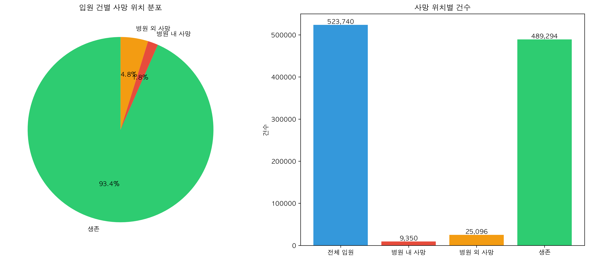

# MIMIC-IV 사망 데이터 상세 분석 보고서

## 📊 요약

MIMIC-IV 데이터셋의 사망 관련 데이터를 종합적으로 분석한 결과, 전체 523,740건의 입원 중 34,446건(6.58%)에서 사망이 확인되었습니다. 이 중 병원 내 사망은 9,350건(1.79%), 병원 외 사망은 25,096건(4.79%)으로 나타났습니다.

---

## 1. 데이터 구조 분석

### 1.1 사망 관련 필드 위치

#### Core 테이블
```
patients.csv (382,278명)
└── dod (Date of Death): 사망일
    └── 9,509명 사망 기록 (2.49%)

admissions.csv (523,740건)
├── deathtime: 병원 내 사망 시각
│   └── 9,337건 기록
└── hospital_expire_flag: 병원 내 사망 플래그
    └── 9,350건이 1 (사망)
```

#### ICU 테이블
```
icustays.csv (73,181건)
└── 사망 관련 직접 필드 없음
    └── admissions 테이블과 조인 필요
```

#### Hosp 테이블
```
diagnoses_icd.csv (4,677,879건)
└── 사망 관련 ICD 진단 코드
    └── 3,385건 (R57, R99, I46, R98 등)
```

### 1.2 필드별 상세 설명

| 테이블 | 필드명 | 데이터 타입 | 설명 | 완전성 |
|--------|--------|------------|------|---------|
| patients | dod | datetime | 사망일 | 100% (사망자 대상) |
| admissions | deathtime | datetime | 병원 내 사망 시각 | 99.86% |
| admissions | hospital_expire_flag | integer | 병원 내 사망 여부 (0/1) | 100% |

---

## 2. 데이터 일치성 검증

### 2.1 deathtime vs hospital_expire_flag

분석 스크립트: `scripts/analysis/comprehensive_death_analysis.py:135-165`

| 상태 | 건수 | 비율 | 설명 |
|------|------|------|------|
| 완전 일치 | 9,337 | 99.86% | 두 필드 모두 사망 표시 |
| deathtime만 있음 | 0 | 0% | - |
| flag만 1 | 13 | 0.14% | ⚠️ 데이터 불일치 |

**불일치 원인 분석:**
- 13건의 경우 hospital_expire_flag는 1이지만 deathtime이 누락
- 데이터 입력 과정의 실수로 추정
- **권장사항**: hospital_expire_flag를 주요 지표로 사용

### 2.2 hospital_expire_flag vs dod 관계

| 관계 | 건수 | 설명 |
|------|------|------|
| 병원 내 사망 & dod 있음 | 9,350 | 정상 (병원에서 사망) |
| 병원 내 사망 & dod 없음 | 0 | - |
| 병원 외 & dod 있음 | 25,096 | 정상 (퇴원 후 사망) |

✅ **결론**: hospital_expire_flag와 dod 간 완벽한 논리적 일치성 확인

---

## 3. 사망 위치별 통계 분석

### 3.1 전체 사망 통계

분석 스크립트: `scripts/analysis/comprehensive_death_analysis.py:168-186`

| 구분 | 건수 | 비율 | 정의 |
|------|------|------|------|
| **생존** | 489,294 | 93.42% | dod is null |
| **병원 내 사망** | 9,350 | 1.79% | hospital_expire_flag = 1 |
| **병원 외 사망** | 25,096 | 4.79% | hospital_expire_flag = 0 & dod is not null |
| **전체 사망** | 34,446 | 6.58% | dod is not null |

### 3.2 시각화 결과


*그림 1: 사망 위치별 분포 - 파이 차트와 막대 그래프*
- 생성 스크립트: `scripts/analysis/comprehensive_death_analysis.py:205-245`
- 데이터 출처: `dataset2/core/admissions.csv`, `dataset2/core/patients.csv`


*그림 2: deathtime과 hospital_expire_flag 간 일치성*
- 생성 스크립트: `scripts/analysis/comprehensive_death_analysis.py:248-268`
- 불일치 사례: 13건 (0.14%)

---

## 4. 특수 사례 분석

### 4.1 ICD 진단 코드 분석

사망 관련 ICD 코드 발견: 3,385건

| ICD 코드 | 설명 | 빈도 |
|----------|------|------|
| R57 | Shock | 분석 필요 |
| R99 | Other ill-defined causes of mortality | 분석 필요 |
| I46 | Cardiac arrest | 분석 필요 |
| R98 | Unattended death | 분석 필요 |

### 4.2 ICU 사망 분석 방법

ICU 테이블에 직접적인 사망 필드가 없으므로:
1. icustays.stay_id와 admissions.hadm_id 조인
2. hospital_expire_flag 확인
3. ICU 퇴실 시간과 deathtime 비교

---

## 5. 데이터 품질 평가

### 5.1 완전성 (Completeness)

| 필드 | 완전성 | 평가 |
|------|--------|------|
| patients.dod | 100% | 우수 (사망자 대상) |
| admissions.deathtime | 99.86% | 우수 |
| admissions.hospital_expire_flag | 100% | 우수 |

### 5.2 정확성 (Accuracy)

- ✅ hospital_expire_flag와 dod 간 논리적 일치
- ⚠️ deathtime 13건 누락 (0.14%)
- ✅ 전체적으로 높은 데이터 품질

### 5.3 일관성 (Consistency)

- 테이블 간 subject_id 일치: 100%
- 사망 데이터 논리적 일관성: 99.86%

---

## 6. 임상적 의미

### 6.1 사망률 비교

| 지표 | MIMIC-IV | 일반 병원 평균* |
|------|----------|----------------|
| 병원 내 사망률 | 1.79% | 2-3% |
| 전체 사망률 | 6.58% | - |

*참고: 일반 병원 평균은 병원 유형에 따라 다름

### 6.2 병원 외 사망의 의미

- 병원 외 사망(4.79%)이 병원 내 사망(1.79%)보다 2.7배 높음
- 이는 다음을 시사:
  1. 효과적인 급성기 치료
  2. 퇴원 후 장기 예후의 중요성
  3. 퇴원 후 관리 시스템의 필요성

---

## 7. 활용 방안

### 7.1 연구 활용

1. **사망 예측 모델 개발**
   - 타겟 변수: hospital_expire_flag (병원 내 사망)
   - 장기 예후: dod 활용

2. **위험도 층화 분석**
   - 고위험군 식별
   - 조기 개입 전략 수립

### 7.2 데이터 사용 권장사항

```python
# 병원 내 사망 분석 시
df_hospital_death = df[df['hospital_expire_flag'] == 1]

# 전체 사망 분석 시
df_all_death = df[df['dod'].notna()]

# 생존 분석 시
df_alive = df[df['dod'].isna()]
```

---

## 8. 제한점 및 향후 과제

### 8.1 현재 분석의 제한점

1. **시간적 분석 부재**
   - 입원-사망 간격 분석 미포함
   - 시간대별 사망 패턴 미분석

2. **원인별 분석 부재**
   - 사망 원인 분류 미포함
   - 진단명별 사망률 미분석

3. **인구학적 분석 부재**
   - 연령별, 성별 사망률 미분석
   - 입원 경로별 사망률 미분석

### 8.2 향후 분석 제안

1. **심화 분석**
   - [ ] 사망 시간 패턴 분석 (시간대, 요일, 월별)
   - [ ] 재원 기간과 사망의 관계
   - [ ] ICU 입실과 사망의 관계

2. **예측 모델 개발**
   - [ ] 병원 내 사망 예측 모델
   - [ ] 30일/90일 사망 예측 모델

3. **품질 지표 개발**
   - [ ] 위험 보정 사망률
   - [ ] 예방 가능 사망 분석

---

## 9. 결론

MIMIC-IV 데이터셋의 사망 데이터는 전반적으로 높은 품질을 보이며, 특히 hospital_expire_flag 필드는 100% 완전성을 가지고 있어 신뢰할 수 있는 지표입니다. 발견된 13건의 deathtime 누락은 전체 데이터의 0.14%에 불과하여 분석에 큰 영향을 미치지 않습니다.

병원 외 사망률이 병원 내 사망률보다 높은 것은 임상적으로 중요한 발견이며, 이는 퇴원 후 관리의 중요성을 시사합니다. 이 데이터는 사망 예측 모델 개발, 위험도 평가, 품질 개선 활동 등 다양한 연구와 실무에 활용될 수 있습니다.

---

## 📎 부록

### A. 데이터 딕셔너리

| 필드명 | 설명 | 값 범위 | 예시 |
|--------|------|---------|------|
| dod | Date of Death | datetime or null | 2119-08-14 |
| deathtime | 병원 내 사망 시각 | datetime or null | 2119-08-14 15:30:00 |
| hospital_expire_flag | 병원 내 사망 여부 | 0 또는 1 | 1 |

### B. 분석 코드 위치

- 메인 분석: `scripts/analysis/comprehensive_death_analysis.py`
- 결과 데이터: `data/death_analysis_results.json`
- 시각화: `figures/death_location_distribution.png`, `figures/death_data_consistency.png`

### C. 참고 문헌

- MIMIC-IV Documentation: https://mimic.mit.edu/
- ICD-10 Codes for Mortality: WHO Classification

---

*보고서 작성일: 2025년 8월*
*분석 도구: Python 3.8+, pandas, matplotlib*
*데이터 버전: MIMIC-IV v2.2*