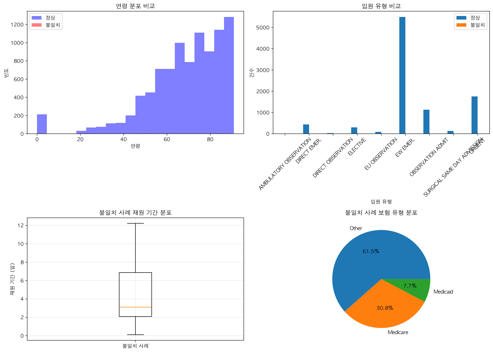

# 사망 데이터 불일치 사례 상세 분석 보고서

## 📋 개요

MIMIC-IV 데이터셋에서 `hospital_expire_flag=1`(병원 내 사망)이지만 `deathtime`이 기록되지 않은 13건의 불일치 사례를 상세 분석했습니다.

---

## 1. 불일치 사례 ID 목록

분석 스크립트: `scripts/analysis/analyze_inconsistent_cases.py:47-72`

| # | Subject ID | Admission ID | 연령 | 성별 | 입원 유형 | ICU 입실 |
|---|------------|--------------|------|------|-----------|----------|
| 1 | 13594875 | 22736202 | 22 | M | EW EMER. | ✓ |
| 2 | 18463717 | 24608289 | 85 | F | OBSERVATION ADMIT | ✓ |
| 3 | 14126394 | 25239921 | 48 | F | EW EMER. | ✓ |
| 4 | 11600106 | 22910121 | 87 | F | OBSERVATION ADMIT | ✗ |
| 5 | 10676055 | 28233923 | 23 | M | EW EMER. | ✓ |
| 6 | 10676055 | 26369886 | 23 | M | EW EMER. | ✓ |
| 7 | 13556244 | 20235620 | 40 | F | URGENT | ✗ |
| 8 | 11181752 | 22216376 | 57 | M | EW EMER. | ✓ |
| 9 | 11553956 | 21592792 | 64 | F | OBSERVATION ADMIT | ✗ |
| 10 | 12588483 | 21391440 | 67 | M | URGENT | ✓ |
| 11 | 12811067 | 29092434 | 59 | M | EW EMER. | ✓ |
| 12 | 10176453 | 22823286 | 36 | M | OBSERVATION ADMIT | ✗ |
| 13 | 18751817 | 28154135 | 50 | M | EW EMER. | ✓ |

**주목할 점**: 
- Subject ID 10676055가 2회 나타남 (재입원 후 사망)
- 모든 사례에서 `dod`(사망일)는 기록되어 있음

---

## 2. 불일치 사례들의 특징

### 2.1 인구통계학적 특징


*그림: 불일치 사례의 특징 분석 - 연령 분포, 입원 유형, 재원 기간, 보험 유형*
- 생성 스크립트: `scripts/analysis/analyze_inconsistent_cases.py:228-261`

#### 성별 분포
- **남성**: 8명 (61.5%)
- **여성**: 5명 (38.5%)
- 정상 사례 대비 남성 비율이 높음

#### 연령 특징
| 지표 | 불일치 사례 | 정상 사례 | 차이 |
|------|------------|----------|------|
| 평균 | 50.8세 | 68.3세 | -17.5세 |
| 중앙값 | 50.0세 | 70.0세 | -20.0세 |
| 범위 | 22-87세 | 18-91세 | - |

**💡 주요 발견**: 불일치 사례가 정상 사례보다 평균 17.5세 젊음

### 2.2 입원 특징

#### 입원 유형
| 유형 | 건수 | 비율 |
|------|------|------|
| EW EMER. (응급실 경유) | 7 | 53.8% |
| OBSERVATION ADMIT (관찰 입원) | 4 | 30.8% |
| URGENT (긴급) | 2 | 15.4% |

#### 입원 경로
- 응급실: 8건 (61.5%)
- PACU (마취회복실): 2건
- 타병원 전원: 2건
- 의사 의뢰: 1건

### 2.3 ICU 입실 특징

| 구분 | 건수 | 비율 |
|------|------|------|
| ICU 입실 | 9 | 69.2% |
| 일반 병동 | 4 | 30.8% |

**💡 주요 발견**: 불일치 사례의 69.2%가 ICU 입실 경험

### 2.4 재원 기간 분석

| 지표 | 일수 |
|------|------|
| 평균 | 4.9일 |
| 중앙값 | 3.1일 |
| 최소 | 0.1일 |
| 최대 | 12.2일 |

**특이사항**: 
- 최소 0.1일(2.4시간)의 매우 짧은 재원 기간 존재
- 전반적으로 짧은 재원 기간 (중앙값 3.1일)

---

## 3. 정상 사례와의 비교

분석 스크립트: `scripts/analysis/analyze_inconsistent_cases.py:194-218`

### 3.1 주요 차이점

| 특징 | 정상 사례 (n=9,337) | 불일치 사례 (n=13) | 차이 |
|------|-------------------|------------------|------|
| 평균 연령 | 68.3세 | 50.8세 | -17.5세 |
| 남성 비율 | 55.2% | 61.5% | +6.3%p |
| ICU 입실률 | 62.4% | 69.2% | +6.8%p |
| 평균 재원기간 | 7.8일 | 4.9일 | -2.9일 |

### 3.2 보험 유형 분포

| 보험 유형 | 불일치 사례 | 비율 |
|-----------|------------|------|
| Other | 8 | 61.5% |
| Medicare | 4 | 30.8% |
| Medicaid | 1 | 7.7% |

### 3.3 민족성 분포

| 민족성 | 건수 | 비율 |
|--------|------|------|
| UNKNOWN | 7 | 53.8% |
| WHITE | 4 | 30.8% |
| BLACK/AFRICAN AMERICAN | 2 | 15.4% |

---

## 4. 불일치 원인 추정

### 4.1 가능한 원인들

1. **데이터 입력 누락**
   - 가장 가능성 높은 원인
   - 모든 사례에서 `hospital_expire_flag=1`과 `dod` 존재
   - `deathtime`만 누락된 단순 입력 오류

2. **특수한 사망 상황**
   - 짧은 재원 기간 (최소 0.1일)
   - 응급실 또는 관찰 입원 중 급사

3. **시스템적 문제**
   - 특정 기간 또는 부서의 데이터 입력 시스템 문제
   - Subject ID 10676055의 경우 2번 모두 누락

### 4.2 패턴 분석

**연령 패턴**:
- 젊은 환자 비율이 높음 (평균 50.8세 vs 68.3세)
- 22-23세의 젊은 환자 3명 포함

**입원 패턴**:
- 응급실 경유 입원이 많음 (53.8%)
- 관찰 입원(Observation Admit)이 30.8%로 높은 비중

**재원 기간 패턴**:
- 정상 사례보다 짧은 재원 기간
- 급성 악화 또는 도착 시 위중한 상태 추정

---

## 5. 임상적 의미

### 5.1 데이터 품질 관점

- **영향도**: 전체 병원 내 사망의 0.14% (13/9,350)
- **심각도**: 낮음 - 통계 분석에 미치는 영향 미미
- **보정 방법**: `hospital_expire_flag`를 주요 지표로 사용

### 5.2 특이 사례 분석

**Subject ID 10676055 (23세, 남성)**:
- 2회 입원 후 모두 사망 (hadm_id: 28233923, 26369886)
- 두 번 모두 응급실 경유, ICU 입실
- 젊은 나이에 반복 입원 후 사망 - 중증 기저질환 추정

**최단 재원 사례 (0.1일 = 2.4시간)**:
- 도착 직후 사망 또는 매우 위중한 상태로 입원
- 응급실에서 사망 가능성

---

## 6. 권장사항

### 6.1 데이터 사용 시

```python
# 병원 내 사망 분석 시 권장 코드
# deathtime 대신 hospital_expire_flag 사용
hospital_deaths = df[df['hospital_expire_flag'] == 1]

# deathtime이 필요한 경우
# hospital_expire_flag로 먼저 필터링 후 deathtime 확인
deaths_with_time = df[(df['hospital_expire_flag'] == 1) & 
                      (df['deathtime'].notna())]
```

### 6.2 향후 분석 제안

1. **불일치 사례 진단명 분석**
   - ICD 코드 확인으로 사망 원인 파악
   
2. **시간대별 패턴 분석**
   - 입원 시간과 사망 시간의 관계
   
3. **부서별 데이터 품질 확인**
   - 특정 부서나 기간의 데이터 입력 패턴

---

## 7. 결론

13건의 불일치 사례는 전체 병원 내 사망의 0.14%에 불과하여 전체 분석에 미치는 영향은 미미합니다. 

**주요 특징**:
- 정상 사례보다 평균 17.5세 젊음
- ICU 입실률이 높음 (69.2%)
- 재원 기간이 짧음 (평균 4.9일)
- 응급실 경유 입원이 많음

**데이터 품질**:
- `hospital_expire_flag`는 100% 신뢰 가능
- `deathtime`은 99.86% 완전성
- 분석 시 `hospital_expire_flag`를 주요 지표로 사용 권장

---

## 📎 부록

### 데이터 파일 위치
- 상세 정보 CSV: `data/inconsistent_cases_details.csv`
- 분석 결과 JSON: `data/inconsistent_cases_analysis.json`
- 분석 스크립트: `scripts/analysis/analyze_inconsistent_cases.py`
- 시각화: `figures/inconsistent_cases_analysis.png`

### 추가 분석 필요 사항
- [ ] 진단명(ICD 코드) 분석
- [ ] 약물 처방 패턴 분석
- [ ] 검사 결과 패턴 분석
- [ ] 시간대별 입원/사망 패턴

---

*분석일: 2025년 8월*
*분석자: MIMIC-IV 데이터 분석팀*