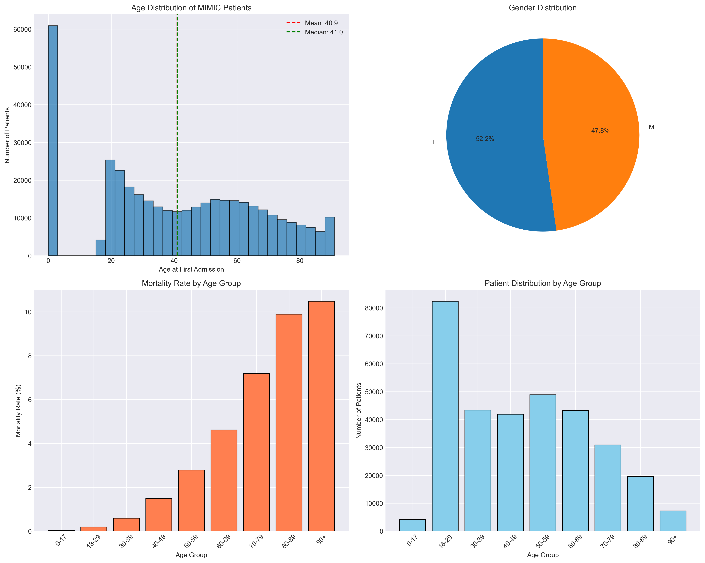
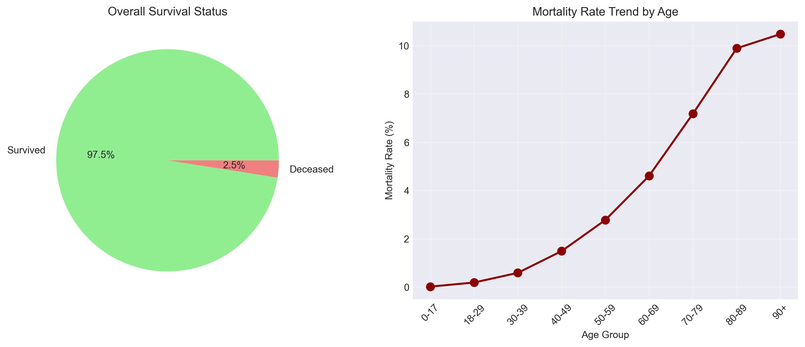

# Demographic Analysis - MIMIC 데이터셋 기초 분석

## 📌 개요
MIMIC 데이터셋의 환자 인구통계학적 특성을 분석하여 전체 사망률, 연령별 사망률을 파악하고,
향후 연구를 위한 적절한 샘플링 전략을 제시합니다.

## 🎯 분석 목표
- 목표 1: 전체 환자 규모 및 입원 패턴 파악
- 목표 2: 전체 사망률 및 연령별 사망률 분석
- 목표 3: 효과적인 데이터 샘플링 전략 수립

## 📊 사용 데이터
| 파일명 | 설명 | 크기 |
|--------|------|------|
| `../dataset2/core/patients.csv` | 환자 기본정보 | 382,278 행 |
| `../dataset2/core/admissions.csv` | 입원 정보 | 523,740 행 |

## 🔧 주요 코드 설명

### 데이터 로딩 (scripts/analysis/demographic_analysis.py:22-37)
```python
patients = pd.read_csv('dataset2/core/patients.csv')
admissions = pd.read_csv('dataset2/core/admissions.csv')
```
CSV 파일을 읽어 patients와 admissions 데이터프레임으로 변환합니다.

### 연령별 분석 (scripts/analysis/demographic_analysis.py:96-147)
환자의 anchor_age(첫 입원 시 연령)를 사용하여 연령 그룹을 생성하고 사망률을 계산합니다.

## 🚀 실행 방법

### 필요한 도구
- Python 3.8 이상
- pandas, numpy, matplotlib, seaborn

### 실행 명령
```bash
# 프로젝트 루트에서
source .venv/bin/activate
cd analysis_demographic
python scripts/analysis/demographic_analysis.py
```

## 📈 주요 발견사항

### 전체 통계
1. **전체 규모**: 382,278명의 환자, 523,740건의 입원
2. **평균 입원 횟수**: 환자당 1.37회
3. **성별 분포**: 여성 52.2%, 남성 47.8%

### 사망률 분석
1. **병원 내 사망률**: 1.79% (9,350건)
2. **전체 사망률**: 2.49% (9,509명)
3. **연령별 사망률**: 연령이 증가할수록 급격히 상승
   - 18-29세: 0.19%
   - 50-59세: 2.78%
   - 70-79세: 7.18%
   - 90세 이상: 10.48%

### 샘플링 권장사항
1. **통계적 대표 샘플**: 384명 (95% 신뢰수준)
2. **탐색적 분석**: 1,000-5,000명
3. **모델 개발**: 10,000-20,000명
4. **검증 연구**: 30,000-50,000명

### 시각화 결과

*그림 1: 연령 분포, 성별 분포, 연령별 사망률 및 환자 수*


*그림 2: 전체 생존율 및 연령별 사망률 추세*

## ❓ 자주 묻는 질문

**Q: 이 분석은 왜 중요한가요?**
A: 데이터셋의 기본 특성을 이해하고, 연구 목적에 맞는 적절한 샘플 크기를 결정하는 데 필수적입니다.

**Q: 샘플링 시 주의사항은 무엇인가요?**
A: 연령 분포와 사망률의 불균형을 고려하여 층화 샘플링을 사용하는 것이 권장됩니다.

**Q: anchor_age란 무엇인가요?**
A: MIMIC-IV에서 제공하는 환자의 첫 입원 시점 나이로, 개인정보 보호를 위해 정확한 생년월일 대신 제공됩니다.

## 🔗 관련 분석
- [기본 분석](../analysis_basic/README.md)
- [종합 분석](../analysis_comprehensive/README.md)
- [상세 분석](../analysis_detailed/README.md)