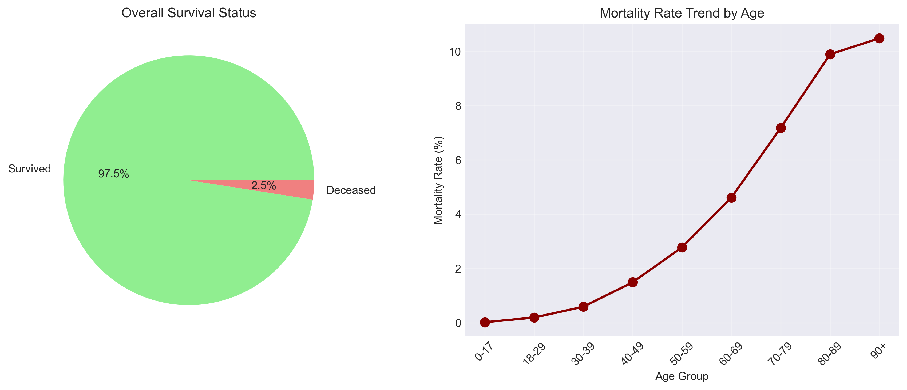

# MIMIC 데이터셋 Demographic Analysis 상세 보고서

## 목차
1. [분석 개요](#1-분석-개요)
2. [데이터 설명](#2-데이터-설명)
3. [분석 방법론](#3-분석-방법론)
4. [주요 발견사항](#4-주요-발견사항)
5. [샘플링 전략](#5-샘플링-전략)
6. [제한사항 및 고려사항](#6-제한사항-및-고려사항)
7. [결론 및 권장사항](#7-결론-및-권장사항)

---

## 1. 분석 개요

### 1.1 분석 목적
MIMIC-IV 데이터셋의 기초적인 인구통계학적 특성을 파악하여:
- 데이터셋의 전반적인 구조와 규모 이해
- 환자 집단의 특성 파악
- 향후 연구를 위한 적절한 샘플링 전략 수립

### 1.2 분석 범위
- **시간적 범위**: MIMIC-IV 전체 기간
- **대상 환자**: 382,278명
- **대상 입원**: 523,740건

### 1.3 핵심 질문
1. MIMIC 데이터셋의 환자 구성은 어떠한가?
2. 연령별 사망률 패턴은 어떻게 나타나는가?
3. 효과적인 연구를 위한 적정 샘플 크기는 얼마인가?

---

## 2. 데이터 설명

### 2.1 사용 테이블
| 테이블명 | 주요 컬럼 | 설명 |
|---------|----------|------|
| `patients.csv` | subject_id, gender, anchor_age, dod | 환자 기본 정보 |
| `admissions.csv` | hadm_id, subject_id, admittime, hospital_expire_flag | 입원 정보 |

### 2.2 주요 변수 정의
- **anchor_age**: 환자의 첫 입원 시점 나이
- **hospital_expire_flag**: 병원 내 사망 여부 (1=사망, 0=생존)
- **dod**: Date of Death (사망일)

---

## 3. 분석 방법론

### 3.1 데이터 전처리
- 결측값 처리: 나이 정보가 없는 환자 제외
- 이상값 처리: 120세 이상 환자 데이터 검토

### 3.2 분석 기법
1. **기술통계**: 평균, 중앙값, 분포
2. **층화분석**: 연령 그룹별 세분화
3. **시각화**: 히스토그램, 파이 차트, 추세선

### 3.3 코드 구조
```
demographic_analysis.py
├── load_data(): 데이터 로딩
├── basic_statistics(): 기본 통계
├── mortality_analysis(): 사망률 분석
├── age_based_analysis(): 연령별 분석
├── sampling_strategy(): 샘플링 전략
└── create_visualizations(): 시각화
```

---

## 4. 주요 발견사항

### 4.1 전체 환자 특성

#### 4.1.1 규모
- **전체 환자 수**: 382,278명
- **전체 입원 건수**: 523,740건
- **환자당 평균 입원**: 1.37회

#### 4.1.2 성별 분포
| 성별 | 환자 수 | 비율 |
|-----|---------|------|
| 여성 | 199,707 | 52.2% |
| 남성 | 182,571 | 47.8% |

### 4.2 연령 분포

#### 4.2.1 중심 경향
- **평균 연령**: 40.9세
- **중앙값**: 41.0세
- **최빈 연령대**: 18-29세 (21.5%)

#### 4.2.2 연령 그룹별 분포
| 연령대 | 환자 수 | 비율 | 특징 |
|--------|---------|------|------|
| 0-17 | 4,166 | 1.1% | 소아 환자 |
| 18-29 | 82,368 | 21.5% | 젊은 성인 |
| 30-39 | 43,336 | 11.3% | 중년 초기 |
| 40-49 | 41,892 | 11.0% | 중년 |
| 50-59 | 48,838 | 12.8% | 중년 후기 |
| 60-69 | 43,118 | 11.3% | 초기 노년 |
| 70-79 | 30,883 | 8.1% | 노년 |
| 80-89 | 19,584 | 5.1% | 고령 |
| 90+ | 7,221 | 1.9% | 초고령 |

### 4.3 사망률 분석

#### 4.3.1 전체 사망률
- **병원 내 사망**: 9,350건 (1.79%)
- **전체 사망 환자**: 9,509명 (2.49%)

#### 4.3.2 연령별 사망률 패턴


**주요 관찰사항**:
1. **지수적 증가**: 50세 이후 사망률이 급격히 증가
2. **고령 고위험**: 90세 이상에서 10.48%의 높은 사망률
3. **젊은 연령 저위험**: 30세 미만은 0.2% 미만의 낮은 사망률

#### 4.3.3 사망률 증가 패턴
| 연령 구간 | 사망률 증가율 |
|-----------|--------------|
| 18-29 → 30-39 | 3.1배 |
| 30-39 → 40-49 | 2.5배 |
| 40-49 → 50-59 | 1.9배 |
| 50-59 → 60-69 | 1.7배 |
| 60-69 → 70-79 | 1.6배 |

---

## 5. 샘플링 전략

### 5.1 통계적 대표 샘플

#### 5.1.1 샘플 크기 계산
```
공식: n = (Z² × p × (1-p)) / E²
- Z = 1.96 (95% 신뢰수준)
- p = 0.5 (최대 변동성)
- E = 0.05 (5% 오차범위)
결과: n = 384명
```

### 5.2 목적별 샘플링 권장사항

| 연구 목적 | 권장 샘플 크기 | 이유 |
|-----------|---------------|------|
| 탐색적 분석 | 1,000-5,000 | 빠른 처리, 기본 패턴 파악 |
| 예측 모델 개발 | 10,000-20,000 | 충분한 학습 데이터 |
| 검증 연구 | 30,000-50,000 | 높은 통계적 검정력 |
| 전체 분석 | 382,278 | 완전한 정보 활용 |

### 5.3 층화 샘플링 전략

#### 5.3.1 연령 기반 층화
- **방법**: 각 연령 그룹별 비례 샘플링
- **장점**: 연령 분포 대표성 유지
- **권장 크기**: 460명 (각 그룹 최소 20명)

#### 5.3.2 결과 균형 샘플링
- **방법**: 사망/생존 50:50 균형
- **장점**: 예측 모델 성능 향상
- **권장 크기**: 576명

#### 5.3.3 다단계 층화
```python
# 권장 샘플링 코드 예시
def stratified_sample(df, n=10000):
    # 1단계: 연령 그룹별 층화
    age_groups = df.groupby('age_group')
    
    # 2단계: 각 그룹 내 사망률 균형
    samples = []
    for name, group in age_groups:
        n_group = int(n * len(group) / len(df))
        sample = group.sample(n=n_group, random_state=42)
        samples.append(sample)
    
    return pd.concat(samples)
```

---

## 6. 제한사항 및 고려사항

### 6.1 데이터 제한사항
1. **Anchor Age 사용**: 정확한 생년월일이 아닌 첫 입원 시 나이 사용
2. **선택 편향**: ICU 중심 데이터로 중증 환자 과대표현
3. **시간적 변화**: 여러 해에 걸친 데이터로 의료 기술 변화 미반영

### 6.2 분석 제한사항
1. **단변량 분석**: 변수 간 상호작용 미고려
2. **생존 기간**: 사망까지의 시간 미분석
3. **재입원 패턴**: 환자별 입원 패턴 심층 분석 필요

### 6.3 해석 시 주의사항
- 병원 내 사망률과 전체 사망률의 차이 인지
- 연령별 사망률은 다른 요인 미조정 상태
- MIMIC 데이터는 단일 의료기관 데이터

---

## 7. 결론 및 권장사항

### 7.1 핵심 결론
1. **대규모 데이터셋**: 38만명 이상의 풍부한 데이터
2. **연령 다양성**: 신생아부터 초고령까지 광범위한 연령 분포
3. **사망률 패턴**: 연령에 따른 명확한 사망률 증가 패턴

### 7.2 향후 분석 권장사항

#### 단기 과제 (1-2주)
1. **시간적 추세 분석**: 연도별 사망률 변화
2. **재입원 분석**: 30일/90일 재입원율
3. **LOS 분석**: 재원 기간 패턴

#### 중기 과제 (1-2개월)
1. **위험 요인 분석**: 다변량 로지스틱 회귀
2. **생존 분석**: Kaplan-Meier, Cox 모델
3. **질병별 분석**: 주요 진단별 outcomes

#### 장기 과제 (3-6개월)
1. **예측 모델 개발**: 사망률, 재입원 예측
2. **클러스터링**: 환자 유형 분류
3. **시계열 분석**: 입원 패턴 예측

### 7.3 실무 적용 가이드

#### 연구자를 위한 가이드
1. **초기 탐색**: 5,000명 샘플로 시작
2. **모델 개발**: 최소 10,000명 사용
3. **검증**: 홀드아웃 셋 20% 확보

#### 임상의를 위한 가이드
1. **위험 계층화**: 연령별 기준선 사망률 참고
2. **자원 배분**: 고위험군 집중 관리
3. **품질 지표**: 연령 조정 사망률 활용

### 7.4 마무리
이 분석은 MIMIC-IV 데이터셋의 기초적인 이해를 제공합니다. 
제시된 샘플링 전략과 분석 방향을 활용하여 더 깊이 있는 연구를 수행할 수 있습니다.

---

## 부록

### A. 분석 코드 위치
- 메인 스크립트: `scripts/analysis/demographic_analysis.py`
- 결과 데이터: `data/demographic_results.json`
- 시각화: `figures/` 폴더

### B. 재현 가능성
```bash
# 환경 설정
source .venv/bin/activate
cd analysis_demographic

# 분석 실행
python scripts/analysis/demographic_analysis.py
```

### C. 추가 자료
- [MIMIC-IV 공식 문서](https://mimic.mit.edu/)
- [pandas 문서](https://pandas.pydata.org/)
- [matplotlib 갤러리](https://matplotlib.org/gallery/)

---

*작성일: 2025년 8월*  
*버전: 1.0*