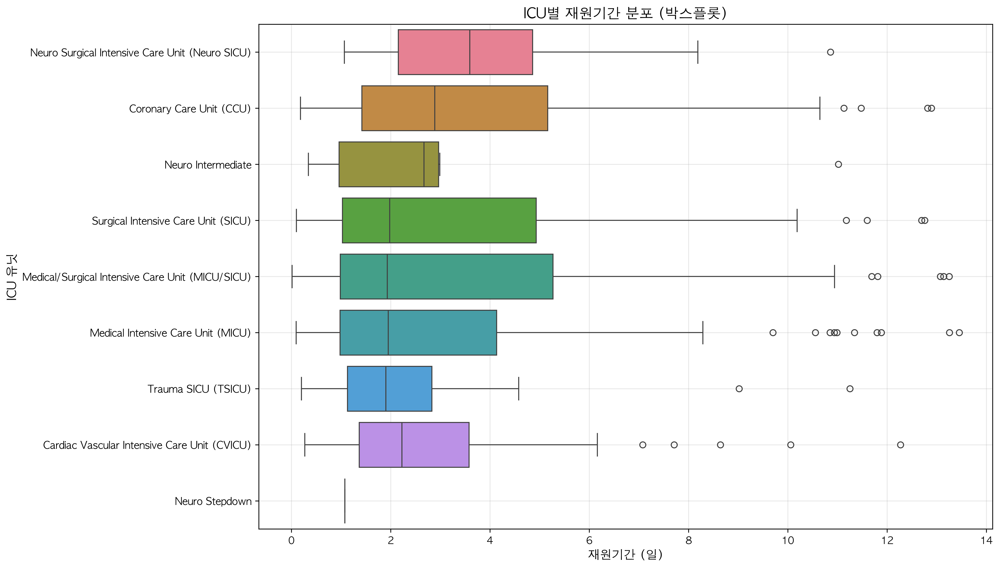
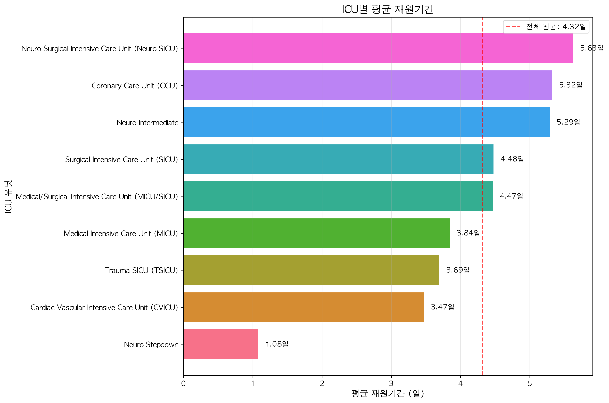
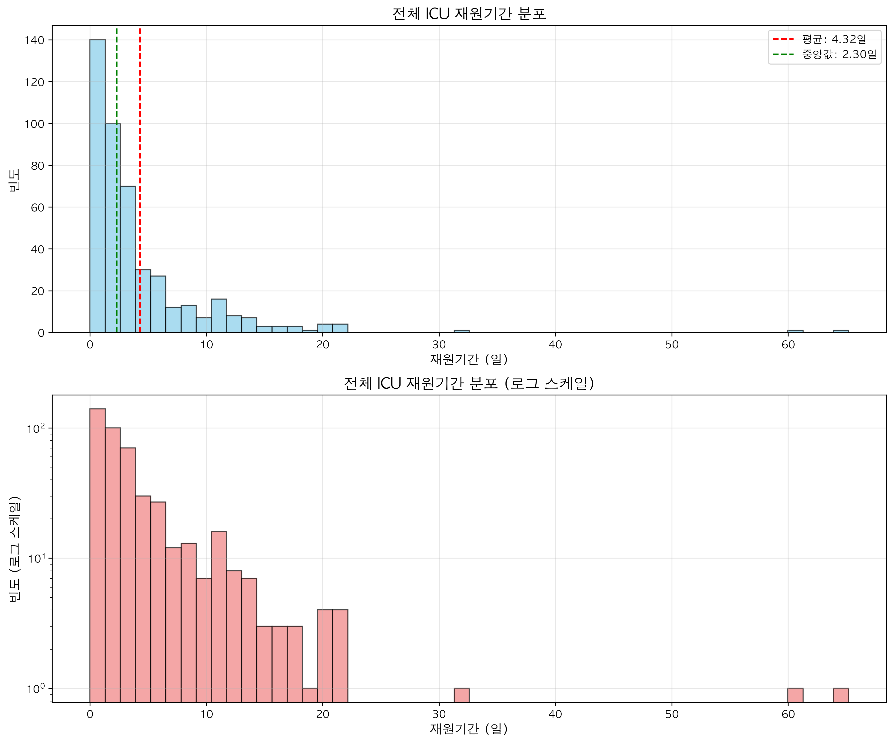
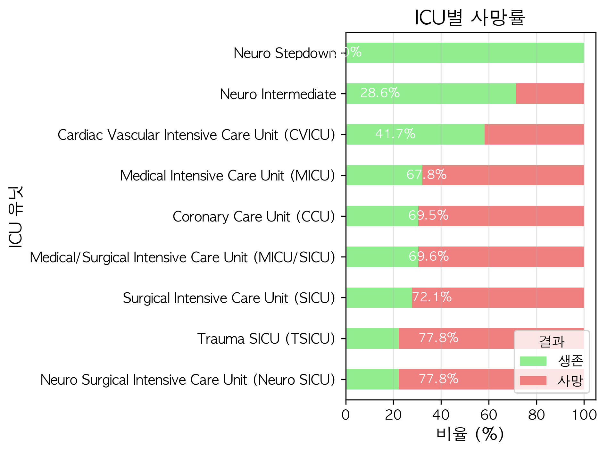
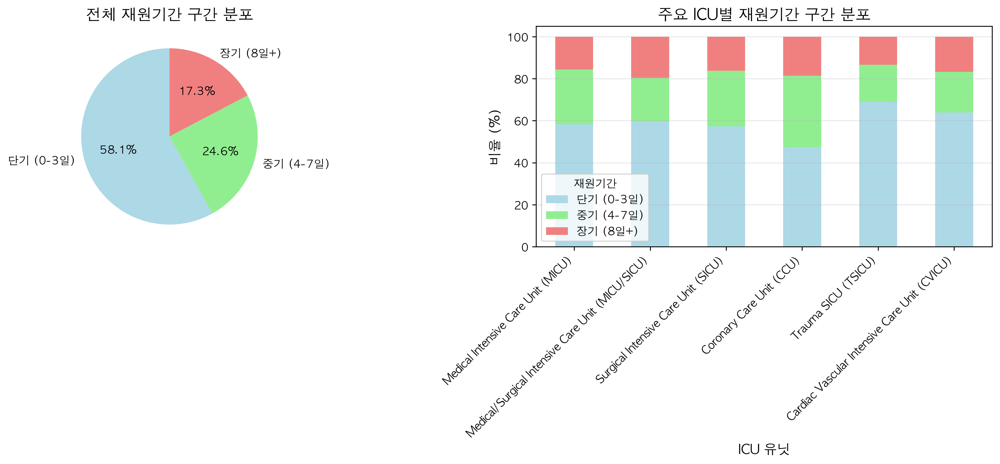

# ICU별 재원기간 분석

## 📌 개요
MIMIC-IV 데이터셋의 샘플링된 1,200명 환자 중 ICU에 입실한 환자들의 재원기간을 분석합니다. ICU 유닛별 재원기간 패턴을 파악하고, 사망률과의 관계를 조사하여 중환자 관리의 인사이트를 도출합니다.

## 🎯 분석 목표
- 목표 1: ICU 유닛별 재원기간 분포와 특성 파악
- 목표 2: 재원기간과 사망률의 상관관계 분석
- 목표 3: ICU 유닛 간 재원기간 차이의 통계적 유의성 검증

## 📋 분석 방법론

### "ICU 재원기간"의 정의
본 분석에서 ICU 재원기간은 다음과 같이 정의됩니다:

1. **시간적 기준**: ICU 입실 시각(intime)부터 퇴실 시각(outtime)까지의 기간
2. **데이터 범위**: 샘플링된 1,200명 중 ICU 입실 기록이 있는 378명(31.5%)
3. **판단 기준**: 재원기간(los) 컬럼의 일(day) 단위 값
4. **제외 기준**: 없음 (모든 ICU 입실 기록 포함)

#### 재원기간 구간 분류
- **단기**: 0-3일 (58.1%)
- **중기**: 4-7일 (24.6%)
- **장기**: 8일 이상 (17.3%)

## 📊 사용 데이터
| 파일명 | 설명 | 크기 |
|--------|------|------|
| `../processed_data/icu/icustays_sampled.csv` | 샘플링된 ICU 입실 정보 | 451 행 |
| `../processed_data/core/admissions_sampled.csv` | 샘플링된 입원 정보 | 1,200 행 |
| `../processed_data/core/patients_sampled.csv` | 샘플링된 환자 기본정보 | 1,171 행 |

## 🔧 주요 코드 설명

### 데이터 추출 (scripts/analysis/extract_sampled_icu_data.py:28-34)
```python
# 샘플링된 입원 ID로 필터링
hadm_ids = admissions['hadm_id'].unique()
sampled_icu = icustays[icustays['hadm_id'].isin(hadm_ids)].copy()
```
원본 ICU 데이터(76,540건)에서 샘플링된 환자들의 기록(451건)만 추출합니다.

### 재원기간 구간 분류 (scripts/analysis/analyze_icu_los.py:38-44)
```python
def categorize_los(los):
    if los <= 3:
        return '단기 (0-3일)'
    elif los <= 7:
        return '중기 (4-7일)'
    else:
        return '장기 (8일+)'
```
재원기간을 임상적 의미가 있는 3개 구간으로 분류합니다.

## 🚀 실행 방법

### 필요한 도구
- Python 3.8 이상
- pandas, numpy, matplotlib, seaborn, scipy 라이브러리

### 실행 명령
```bash
# 가상환경 활성화
source .venv/bin/activate

# 1. ICU 데이터 추출
cd analysis_icu_los
python scripts/analysis/extract_sampled_icu_data.py

# 2. 메인 분석 실행
python scripts/analysis/analyze_icu_los.py
```

## 📈 결과 해석

### 주요 발견사항
1. **ICU별 재원기간 차이**: Neuro SICU가 평균 5.63일로 가장 길고, CVICU가 3.47일로 가장 짧음
2. **사망률과 재원기간**: 사망 환자(4.84일)가 생존 환자(3.24일)보다 약 1.6일 더 긴 재원기간 (p=0.008)
3. **재원기간 분포**: 전체의 58.1%가 3일 이내 단기 입실

### 시각화 결과

*그림 1: ICU 유닛별 재원기간 분포 (95 백분위수까지 표시)*
- 생성 스크립트: `scripts/analysis/analyze_icu_los.py:185-211`


*그림 2: ICU 유닛별 평균 재원기간*
- 생성 스크립트: `scripts/analysis/analyze_icu_los.py:213-239`


*그림 3: 전체 ICU 재원기간 분포 (선형 및 로그 스케일)*
- 생성 스크립트: `scripts/analysis/analyze_icu_los.py:241-267`


*그림 4: ICU 유닛별 사망률*
- 생성 스크립트: `scripts/analysis/analyze_icu_los.py:269-294`


*그림 5: 재원기간 구간별 분포*
- 생성 스크립트: `scripts/analysis/analyze_icu_los.py:296-328`

## ⚠️ 분석의 제한점

### 1. 데이터 제한
- 샘플링된 1,200명 중 ICU 입실 환자만 분석 (전체 데이터의 일부)
- 사망률이 높은 환자 위주로 샘플링되어 일반적인 ICU 현황과 차이 가능

### 2. 방법론적 제한
- ICU 간 전실(transfer) 고려 미흡 (first_careunit 기준)
- 질병 중증도나 진단명을 고려하지 않은 단순 비교
- ANOVA 검정 결과 ICU 간 통계적 차이 없음 (p=0.613)

### 3. 해석상 주의점
- 높은 사망률(67.6%)은 샘플링 특성에 기인
- 재원기간이 긴 것이 반드시 나쁜 예후를 의미하지 않음
- ICU 유닛별 특성(수술 후 관리 vs 내과계 중환자)을 고려 필요

## ❓ 자주 묻는 질문

**Q: 왜 Neuro SICU의 재원기간이 가장 긴가요?**
A: 신경외과 중환자실은 뇌수술 후 환자나 중증 신경계 질환 환자를 관리하는 곳으로, 회복 기간이 상대적으로 길고 신중한 모니터링이 필요합니다.

**Q: 사망 환자의 재원기간이 더 긴 이유는?**
A: 중증 환자일수록 집중치료 기간이 길어지며, 다양한 치료 시도에도 불구하고 사망에 이르는 경우가 많기 때문입니다.

**Q: 이 분석 결과를 어떻게 활용할 수 있나요?**
A: ICU 병상 운영 계획, 의료진 배치, 자원 할당 등 병원 운영 효율화에 활용할 수 있으며, ICU별 특성을 고려한 맞춤형 치료 전략 수립에 도움이 됩니다.

## 🔗 관련 분석
- [종합 분석](../analysis_comprehensive/README.md)
- [샘플링 방법론](../analysis_samplingmethod/README.md)
- [초기 검사 분석](../analysis_initial_lab/README.md)