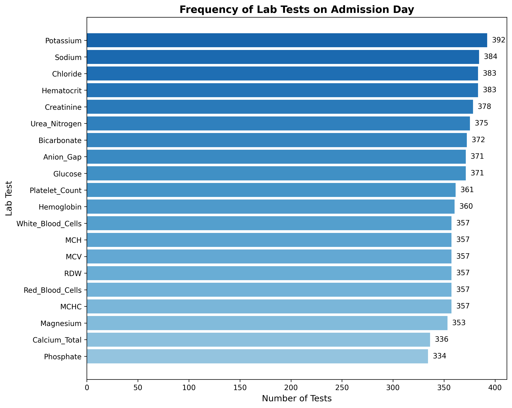
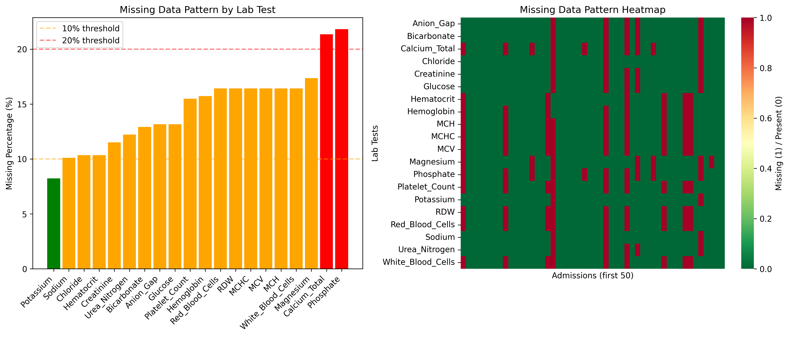
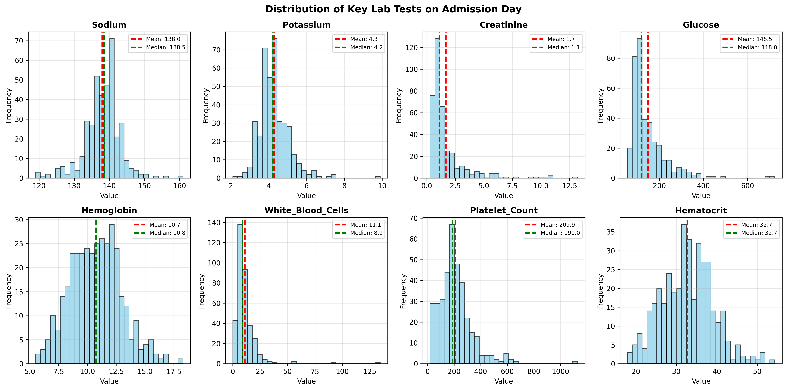
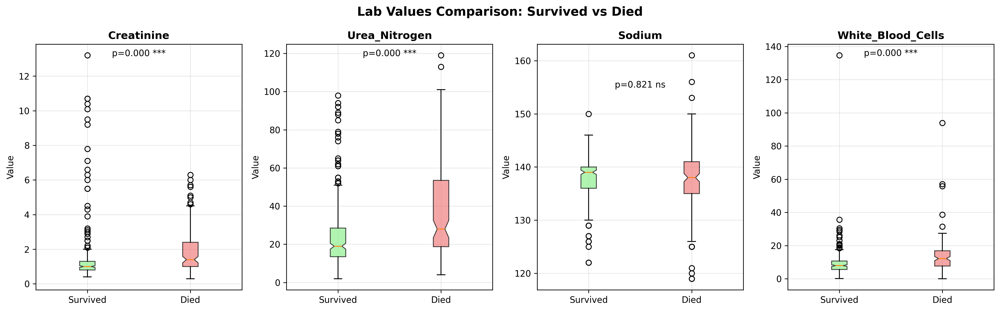

# 입원 당일 혈액검사 데이터 추출 분석

## ⚠️ 중요 업데이트 (2025-08-19)
**이 분석은 방법론적 오류가 있어 재작업되었습니다.**

### 문제가 있는 파일들 (사용 금지)
- ❌ `scripts/analysis/extract_admission_day_labs.py` - 검사 있는 환자만 추출
- ❌ `data/admission_day_labs.csv` - 427건만 포함 (773건 누락)
- ❌ `data/admission_day_labs_wide.csv` - 427건만 포함
- ❌ `data/lab_statistics.json` - 불완전한 통계

### 문제점
- 현재: 21개 검사 중 1개라도 시행한 427건(35.6%)만 분석 → **선택 편향**
- 결과: 전체 1,200건의 결측값 패턴 파악 불가능
- 영향: 검사를 하지 않은 환자의 특성 분석 불가

### 개선된 파일들 (사용 권장)
- ✅ `scripts/analysis/extract_labs_with_window.py` - 모든 1,200건 유지
- ✅ `data/labs_with_window_wide.csv` - 1,200건 모두 포함
- ✅ `data/labs_with_window_long.csv` - 시간 윈도우 적용
- ✅ `data/lab_statistics_window.json` - 완전한 통계

## 📌 개요
이 분석은 MIMIC-IV 데이터셋에서 환자의 입원 당일 시행된 주요 혈액검사 결과를 추출합니다.
73개의 중요한 검사 항목을 대상으로 하며, 향후 사망률 예측 모델 개발의 기초 데이터로 활용됩니다.

## 🎯 분석 목표
- 목표 1: d_labitems_inclusion.csv에서 inclusion=1로 표시된 73개 검사 추출
- 목표 2: 1,200개 모든 입원 건에 대한 데이터 유지 (결측값 포함)
- 목표 3: 입원 당일(admission date) 검사 데이터만 추출

## 📊 사용 데이터
| 파일명 | 설명 | 크기 |
|--------|------|------|
| `../processed_data/core/admissions_sampled.csv` | 샘플링된 입원 정보 | 1,200 행 |
| `../processed_data/core/patients_sampled.csv` | 환자 기본정보 | 1,171 행 |
| `../processed_data/hosp/labevents_sampled.csv` | 검사 데이터 | 2,825,084 행 |
| `../processed_data/hosp/d_labitems_inclusion.csv` | 검사 항목 정의 | 1,631 행 (87개 포함) |

## 🔧 주요 코드 설명

### 데이터 추출 (scripts/analysis/extract_admission_day_labs.py:69-142)
입원 당일 검사 데이터를 추출하는 최적화된 알고리즘:
- hadm_id 기반 직접 매칭과 subject_id + 날짜 기반 매칭 병행
- 중복 검사 제거 (동일 검사 여러 번 시행 시 첫 번째만 사용)

### 분석 및 시각화 (scripts/analysis/analyze_initial_labs.py)
추출된 데이터를 분석하고 다양한 시각화 생성:
- 검사 빈도 분석
- 결측값 패턴 분석
- 분포 시각화
- 사망률별 비교

## 🚀 실행 방법

### 필요한 도구
- Python 3.8 이상
- pandas, numpy, matplotlib, seaborn, scipy 라이브러리

### 실행 명령 (개선된 버전)
```bash
cd analysis_initial_lab

# ✅ 올바른 방법 (권장)
python scripts/analysis/extract_labs_with_window.py

# ❌ 잘못된 방법 (사용 금지)
# python scripts/analysis/extract_admission_day_labs.py  # 선택 편향
# python scripts/analysis/analyze_initial_labs.py        # 불완전한 분석
```

### 파일 구조 및 용도
```
analysis_initial_lab/
├── scripts/analysis/
│   ├── ❌ extract_admission_day_labs.py    # 잘못된 추출 (427건만)
│   ├── ❌ analyze_initial_labs.py          # 잘못된 분석
│   └── ✅ extract_labs_with_window.py      # 올바른 추출 (1,200건)
├── data/
│   ├── ❌ admission_day_labs.csv           # 불완전 (427건)
│   ├── ❌ admission_day_labs_wide.csv      # 불완전 (427건)
│   ├── ❌ lab_statistics.json              # 왜곡된 통계
│   ├── ✅ labs_with_window_long.csv        # 완전한 데이터 (45,275행)
│   ├── ✅ labs_with_window_wide.csv        # 완전한 데이터 (1,200행)
│   └── ✅ lab_statistics_window.json       # 정확한 통계
└── reports/
    ├── improved_methodology_report.md       # 개선 방법론 설명
    └── comparison_analysis_report.md        # 방법론 비교 분석
```

## 📋 분석 방법론

### "입원 당일 혈액검사 시행"의 정의
본 분석에서 입원 당일 검사 시행 여부는 다음과 같이 정의됩니다:

1. **시간적 기준**: 입원일(`admittime`)과 검사일(`charttime`)이 같은 날짜 (00:00~23:59)
2. **검사 범위**: inclusion=1로 표시된 98개 주요 혈액검사 항목 대상
3. **판단 기준**: 98개 검사 중 **최소 1개 이상** 측정 시 "검사 시행"으로 분류

#### 98개 주요 검사 항목 (분석 대상)
- **기본 대사 검사**: Sodium, Potassium, Chloride, Glucose, Creatinine, Urea Nitrogen 등
- **혈액학 검사**: Hemoglobin, Hematocrit, RBC, WBC, Platelet, RDW 등
- **응고 검사**: PT, PTT, D-Dimer 등
- **생화학 검사**: Albumin, Bilirubin, Calcium, Phosphate 등
- **기타**: Lactate, Troponin, NTproBNP 등

## 📈 주요 발견사항

### 1. 검사 시행 현황
- **427개 입원(35.6%)** 에서 입원 당일 21개 주요 검사 중 최소 1개 이상 시행
  - 나머지 773건(64.4%)은 21개 검사를 하나도 시행하지 않음
  - 다른 검사(간기능, 갑상선 등)만 시행한 경우는 미포함
- 검사 시행한 427건 기준 평균 **17.1개** 항목 측정
- 가장 흔한 검사: Potassium(92%), Sodium(90%), Chloride(90%)

### 2. 사망률과의 관계
- 전체 사망률: **36.5%** (156/427)
- 주요 차이를 보이는 검사:
  - **Urea Nitrogen**: 생존군 25.1 vs 사망군 37.4 (p<0.001)
  - **Anion Gap**: 생존군 14.1 vs 사망군 18.1 (p<0.001)
  - **Glucose**: 생존군 139.4 vs 사망군 162.7 (p<0.01)
  - **Bicarbonate**: 생존군 24.8 vs 사망군 21.0 (p<0.001)

### 3. 결측값 패턴
- Basic Metabolic Panel: 8-13% 결측
- Complete Blood Count: 10-16% 결측
- 기타 검사(칼슘, 마그네슘 등): 30-35% 결측

## 📊 시각화 결과

### 검사 빈도 분석

*그림 1: 입원 당일 시행된 검사 항목별 빈도*

### 결측값 패턴

*그림 2: 검사별 결측값 비율 및 패턴 히트맵*

### 검사 결과 분포

*그림 3: 주요 8개 검사 항목의 값 분포*

### 사망률별 비교

*그림 4: 생존/사망 그룹 간 검사 결과 비교 (***p<0.001, **p<0.01, *p<0.05)*

## 💡 임상적 의의

### 조기 위험도 평가
1. **신장 기능**: Creatinine과 Urea Nitrogen이 높은 환자의 사망 위험 증가
2. **대사성 산증**: Anion Gap 상승과 Bicarbonate 감소는 불량한 예후 시사
3. **혈당 조절**: 입원 시 고혈당은 사망률과 연관

### 검사 프로토콜 제안
- 모든 입원 환자: Basic Metabolic Panel + CBC 필수
- 고위험군 선별: Urea Nitrogen > 40, Anion Gap > 20
- 추가 모니터링 필요: 초기 검사 이상 시 6-12시간 내 재검

## ⚠️ 분석의 제한점

### 1. 검사 항목 제한
- **21개 주요 검사만 분석**: 실제로는 더 많은 검사가 시행되었을 수 있음
- 간기능검사(AST, ALT), 심장표지자(Troponin), 염증표지자(CRP) 등 제외
- 실제 "검사 미시행" 비율은 35.6%보다 낮을 가능성

### 2. 시간적 제한
- **날짜 기준만 적용**: 시간 단위 정밀도 부족
- 예: 23:00 응급실 도착, 01:00 입원 → 응급실 검사가 "전날"로 분류되어 제외
- 입원 직전/직후 24시간 내 검사를 포괄하지 못함

### 3. 데이터 매칭 제한
- **중복 검사 처리**: 같은 날 여러 번 측정 시 첫 번째 값만 사용
- 검사 시간대별 변화 추적 불가
- hadm_id 누락된 검사의 경우 subject_id + 날짜로 매칭 (정확도 저하 가능)

### 4. 샘플링 편향
- 균형잡힌 사망률(25%) 샘플링으로 실제 임상 환경과 차이
- 0세 환자 제외로 신생아 중환자실 데이터 미포함
- 1,200건 샘플로 전체 MIMIC-IV 대표성 제한

## ❓ 자주 묻는 질문

**Q: 왜 입원 당일 검사가 있는 환자가 35.6%밖에 안 되나요?**
A: 이는 21개 주요 검사 기준입니다. 실제 이유:
- 많은 환자가 응급실에서 검사 후 다음날 입원
- 계획 입원은 외래에서 사전 검사 완료
- 분석에서 제외된 다른 검사만 시행한 경우
- 입원 다음날 아침 루틴 검사 시행

**Q: 어떤 검사가 가장 중요한가요?**
A: Basic Metabolic Panel(전해질, 신장기능, 혈당)과 CBC(혈구수치)가 가장 기본적이고 중요합니다. 본 분석에서도 이 검사들이 90% 이상 시행되었습니다.

**Q: 이 결과를 어떻게 활용할 수 있나요?**
A: 입원 초기 위험도 평가 모델 개발, 검사 프로토콜 표준화, 조기 중재 대상 선별에 활용할 수 있습니다. 단, 제한점을 고려한 해석이 필요합니다.

## 🎯 최종 데이터 활용 가이드

### 머신러닝 모델 개발을 위한 추천 데이터셋

#### 1. 입원 당일 데이터만 사용 (보수적 접근)
```
파일: data/initial_labs_wide.csv
- 1,200개 입원 × 98개 검사
- 1,053건(87.8%)의 입원에서 검사 데이터 존재
- 입원 시점의 상태를 가장 정확히 반영
```

#### 2. 시간 윈도우 데이터 사용 (권장) ⭐
```
파일: data/labs_time_window_wide.csv
- 1,200개 입원 × 98개 검사 (+ day_offset 정보)
- 1,155건(96.2%)의 입원에서 검사 데이터 존재
- 데이터 완성도 최대화
- day_offset 컬럼으로 데이터 출처 확인 가능
```

### 주요 파일 설명

| 파일명 | 형식 | 차원 | 용도 |
|--------|------|------|------|
| `initial_labs_wide.csv` | Wide | 1,200 × 98 | 입원 당일 검사만 |
| `initial_labs_long.csv` | Long | 14,550 rows | 입원 당일 검사만 (Tidy format) |
| `labs_time_window_wide.csv` | Wide | 1,200 × 196 | 시간 윈도우 적용 (값 + offset) |
| `labs_time_window_long.csv` | Long | 20,118 rows | 시간 윈도우 적용 (Tidy format) |
| `lab_statistics.json` | JSON | - | 입원 당일 통계 |
| `lab_statistics_time_window.json` | JSON | - | 시간 윈도우 통계 |

### 데이터 로딩 예시

```python
import pandas as pd

# 옵션 1: 입원 당일만 (보수적)
df_day0 = pd.read_csv('data/initial_labs_wide.csv')
# 검사 컬럼만 선택 (메타데이터 제외)
lab_columns = [col for col in df_day0.columns 
               if col not in ['hadm_id', 'subject_id', 'admittime', 'hospital_expire_flag']]
X = df_day0[lab_columns]
y = df_day0['hospital_expire_flag']

# 옵션 2: 시간 윈도우 (권장) ⭐
df_window = pd.read_csv('data/labs_time_window_wide.csv')
# 검사 값만 선택 (day_offset 제외)
lab_columns = [col for col in df_window.columns 
               if col not in ['hadm_id', 'subject_id', 'admittime', 'hospital_expire_flag'] 
               and '_day_offset' not in col]
X = df_window[lab_columns]
y = df_window['hospital_expire_flag']

# 옵션 3: 시간 윈도우 + 메타데이터 (고급)
# day_offset 정보도 특징으로 사용
value_columns = [col for col in df_window.columns 
                 if '_day_offset' not in col 
                 and col not in ['hadm_id', 'subject_id', 'admittime', 'hospital_expire_flag']]
offset_columns = [col for col in df_window.columns if '_day_offset' in col]
X = df_window[value_columns + offset_columns]
```

### 모델 성능 비교 권장사항

1. **Baseline 모델**: `initial_labs_wide.csv` 사용
2. **Enhanced 모델**: `labs_time_window_wide.csv` 사용
3. **Advanced 모델**: day_offset 정보를 추가 특징으로 활용
4. **성능 지표**: AUC-ROC, 정확도, 민감도, 특이도

### 데이터 특성 요약

#### 입원 당일 데이터 (initial_labs_wide.csv)
- **장점**: 입원 시점의 순수한 상태 반영
- **단점**: 12.2%의 입원에서 검사 없음
- **용도**: 보수적 접근, 입원 초기 예측

#### 시간 윈도우 데이터 (labs_time_window_wide.csv)
- **장점**: 96.2% 데이터 완성도, 더 많은 샘플
- **단점**: 일부 데이터는 치료 후 상태 반영 가능
- **용도**: 실용적 모델, 높은 예측력

## 🔗 관련 분석
- [샘플링 방법론](../analysis_samplingmethod/README.md)
- [종합 분석](../analysis_comprehensive/README.md)
- [시간 윈도우 분석](./time_window_analysis_report.md)
- [CLAUDE.md 가이드라인](../CLAUDE.md)

---

*작성일: 2025-08-19*
*업데이트: 2025-08-20 (최종 데이터 활용 가이드 추가)*
*분석 도구: Python 3.x, pandas, matplotlib, seaborn*