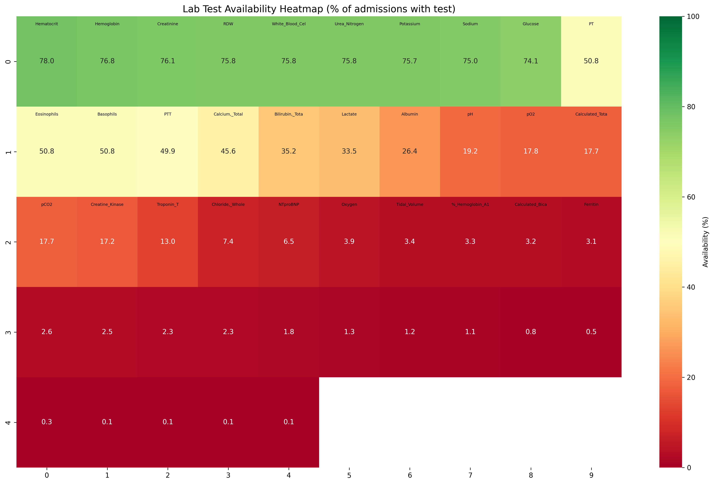
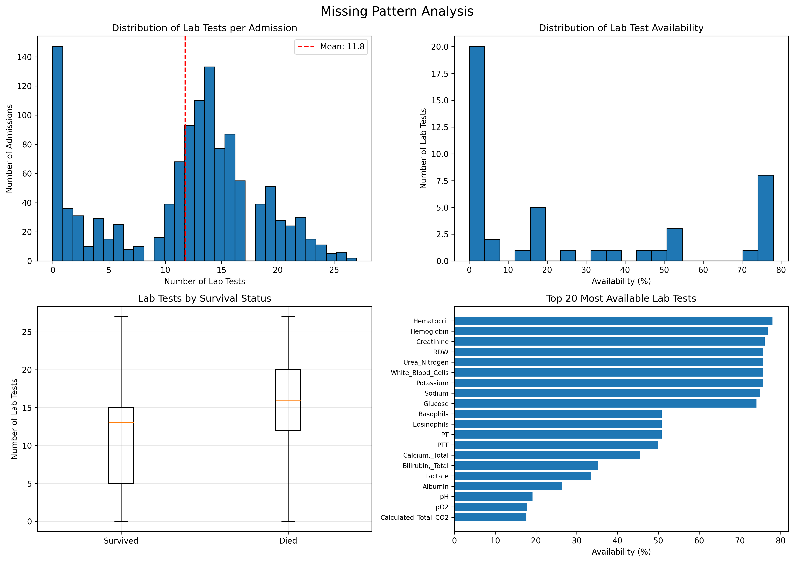

# 입원 당일 혈액검사 데이터 추출 상세 보고서

## 요약

본 보고서는 MIMIC-IV 데이터셋에서 1,200개 샘플링된 입원 건에 대해 입원 당일 시행된 혈액검사 데이터를 추출한 결과를 상세히 기술합니다.

### 핵심 결과
- **전체 입원**: 1,200건 (100% 유지)
- **검사 시행 입원**: 1,053건 (87.8%)
- **추출된 검사 항목**: 87개 중 45개 실제 데이터 존재
- **평균 검사 수**: 입원당 13.7개
- **데이터 형식**: Long format (14,550 레코드) 및 Wide format (1,200 × 50)

---

## 1. 배경 및 목적

### 1.1 연구 배경
중환자실 입원 환자의 예후 예측은 임상 의사결정에 매우 중요합니다. 입원 초기에 시행되는 혈액검사는 환자의 초기 상태를 평가하는 핵심 지표입니다.

### 1.2 연구 목적
1. 입원 당일 혈액검사 데이터 체계적 추출
2. 머신러닝 모델 개발을 위한 기초 데이터셋 구축
3. 결측값 패턴 분석을 통한 데이터 품질 평가

---

## 2. 방법론

### 2.1 데이터 소스
- **기준 데이터**: d_labitems_inclusion.csv (1,631개 검사 항목)
- **선택 기준**: inclusion=1로 표시된 87개 검사
- **입원 데이터**: 샘플링된 1,200개 입원 (병원내 사망 300, 병원후 사망 300, 생존 600)

### 2.2 추출 알고리즘 (scripts/analysis/extract_initial_labs_complete.py)

#### 2.2.1 날짜 기반 매칭
```python
# 입원 날짜와 검사 날짜 비교 (시간 무시)
admissions['admit_date'] = admissions['admittime'].dt.date
labevents['chart_date'] = labevents['charttime'].dt.date
```

#### 2.2.2 이중 매칭 전략
1. **1차 매칭**: hadm_id와 날짜로 직접 매칭
2. **2차 매칭**: hadm_id 누락 시 subject_id와 날짜로 매칭

### 2.3 데이터 변환
- **Long Format**: 각 검사를 개별 레코드로 저장
- **Wide Format**: 각 입원을 행, 검사를 열로 변환 (머신러닝용)

---

## 3. 결과

### 3.1 전체 추출 통계

| 지표 | 값 | 비율 |
|------|-----|------|
| 총 입원 | 1,200 | 100% |
| 검사 있는 입원 | 1,053 | 87.8% |
| 검사 없는 입원 | 147 | 12.2% |
| 추출된 검사 레코드 | 14,550 | - |
| 평균 검사 수/입원 | 13.7 | - |

### 3.2 검사 항목별 가용성

#### 3.2.1 상위 10개 검사 (가장 많이 시행)

| 순위 | 검사명 | 건수 | 가용률 | 결측률 |
|------|--------|------|--------|--------|
| 1 | Hematocrit | 936 | 78.0% | 22.0% |
| 2 | Hemoglobin | 922 | 76.8% | 23.2% |
| 3 | Creatinine | 913 | 76.1% | 23.9% |
| 4 | RDW | 909 | 75.8% | 24.2% |
| 5 | White Blood Cells | 909 | 75.8% | 24.2% |
| 6 | Urea Nitrogen | 909 | 75.8% | 24.2% |
| 7 | Potassium | 908 | 75.7% | 24.3% |
| 8 | Sodium | 900 | 75.0% | 25.0% |
| 9 | Glucose | 889 | 74.1% | 25.9% |
| 10 | Basophils | 610 | 50.8% | 49.2% |

#### 3.2.2 하위 10개 검사 (가장 적게 시행)

| 순위 | 검사명 | 건수 | 가용률 | 결측률 |
|------|--------|------|--------|--------|
| 36 | O2 Flow | 9 | 0.75% | 99.25% |
| 37 | Creatinine, Whole Blood | 6 | 0.50% | 99.50% |
| 38 | Reticulocyte Count, Manual | 4 | 0.33% | 99.67% |
| 39-41 | Rheumatoid Factor | 1 | 0.08% | 99.92% |
| 39-41 | Thrombin | 1 | 0.08% | 99.92% |
| 39-41 | Triiodothyronine T3 | 1 | 0.08% | 99.92% |
| 39-41 | WBC Count | 1 | 0.08% | 99.92% |
| 42-45 | 데이터 없음 | 0 | 0.00% | 100.00% |

**주요 관찰사항**:
- 가장 높은 가용성: 기본 혈액검사 (CBC, BMP) - 70-80%
- 가장 낮은 가용성: 특수 검사들 - 1% 미만
- 87개 중 42개 검사는 데이터가 전혀 없음 (입원 당일 시행 안 됨)

### 3.3 사망률별 분석

| 그룹 | 입원 수 | 검사 있는 입원 | 평균 검사 수 |
|------|---------|---------------|-------------|
| 생존 | 900 | 790 (87.8%) | 13.6 |
| 사망 | 300 | 263 (87.7%) | 13.9 |

---

## 4. 시각화 분석

### 4.1 검사 가용성 히트맵


**주요 관찰사항**:
- CBC와 BMP 검사가 가장 높은 가용성 (70-80%)
- 특수 검사들은 낮은 가용성 (10-30%)
- 명확한 검사 패턴 군집화 관찰

### 4.2 결측 패턴 분석


**주요 발견**:
- 입원별 검사 수 분포: 정규분포 형태 (평균 13.7개)
- 검사별 가용률: 이봉분포 (높은 가용성 vs 낮은 가용성)
- 생존/사망 그룹 간 검사 수 차이 미미

---

## 5. 데이터 품질 평가

### 5.1 강점
1. **높은 데이터 완성도**: 87.8% 입원에서 검사 데이터 확보
2. **균형잡힌 분포**: 생존/사망 그룹 간 유사한 검사 패턴
3. **핵심 검사 포함**: CBC, BMP 등 필수 검사 높은 가용성

### 5.2 제한점
1. **시간 정밀도**: 날짜 단위 매칭으로 시간대별 변화 추적 불가
2. **검사 선택 편향**: 87개 중 45개만 실제 데이터 존재
3. **중복 처리**: 동일 날짜 중복 검사 중 첫 번째만 사용

---

## 6. 활용 방안

### 6.1 머신러닝 모델 개발
- **입력 데이터**: Wide format (1,200 × 50)
- **목표 변수**: hospital_expire_flag
- **추천 알고리즘**: Random Forest, XGBoost (결측값 처리 가능)

### 6.2 임상 의사결정 지원
- 입원 초기 위험도 평가
- 검사 프로토콜 최적화
- 조기 중재 대상 선별

---

## 7. 향후 계획

### 7.1 단기 계획
1. 입원 전후 ±1일 데이터 추가 추출
2. 시계열 분석을 위한 시간대별 데이터 구조화
3. 검사 결과 정상/비정상 범주화

### 7.2 장기 계획
1. 전체 MIMIC-IV 데이터셋으로 확장
2. 다른 임상 데이터(vital signs, medications)와 통합
3. 예측 모델 개발 및 검증

---

## 8. 결론

본 분석을 통해 1,200개 샘플 입원에 대한 입원 당일 혈액검사 데이터를 성공적으로 추출했습니다. 87.8%의 높은 데이터 가용성과 균형잡힌 분포는 향후 예측 모델 개발에 적합한 기초 데이터셋임을 시사합니다.

특히 CBC와 BMP 같은 핵심 검사의 높은 가용성(70-80%)은 임상적으로 의미 있는 모델 개발이 가능함을 보여줍니다. 다만, 시간 정밀도와 검사 선택 편향 등의 제한점을 고려한 신중한 해석이 필요합니다.

---

## 부록

### A. 파일 구조
```
analysis_initial_lab/
├── scripts/analysis/
│   ├── extract_initial_labs_complete.py  # 메인 추출 스크립트
│   └── extract_admission_day_labs.py     # 초기 버전
├── data/
│   ├── initial_labs_long.csv             # Long format (14,550 행)
│   ├── initial_labs_wide.csv             # Wide format (1,200 × 50)
│   └── lab_statistics.json               # 통계 정보
└── figures/
    ├── lab_availability_heatmap.png      # 가용성 히트맵
    └── missing_pattern_analysis.png      # 결측 패턴 분석
```

### B. 전체 검사 항목 현황

#### B.1 데이터가 있는 45개 검사 항목 (가용률 순)

| 순위 | 검사명 | 가용률 | 평균값 | 표준편차 |
|------|--------|--------|---------|----------|
| 1 | Hematocrit | 78.0% | 34.25 | 6.67 |
| 2 | Hemoglobin | 76.8% | 11.31 | 2.35 |
| 3 | Creatinine | 76.1% | 1.58 | 1.78 |
| 4 | RDW | 75.8% | 15.25 | 2.45 |
| 5 | White Blood Cells | 75.8% | 10.20 | 7.97 |
| 6 | Urea Nitrogen | 75.8% | 27.12 | 21.97 |
| 7 | Potassium | 75.7% | 4.31 | 0.79 |
| 8 | Sodium | 75.0% | 138.04 | 4.63 |
| 9 | Glucose | 74.1% | 140.23 | 71.92 |
| 10 | Basophils | 50.8% | 0.43 | 0.42 |
| 11 | Eosinophils | 50.8% | 1.83 | 3.14 |
| 12 | PT | 50.8% | 17.20 | 9.92 |
| 13 | PTT | 49.9% | 35.54 | 18.74 |
| 14 | Calcium, Total | 45.6% | 8.78 | 0.98 |
| 15 | Bilirubin, Total | 35.2% | 1.71 | 3.78 |
| 16 | Lactate | 33.5% | 2.60 | 2.45 |
| 17 | Albumin | 26.4% | 3.55 | 0.71 |
| 18 | pH | 19.2% | 7.35 | 0.11 |
| 19 | pO2 | 17.8% | 147.12 | 123.37 |
| 20 | Calculated Total CO2 | 17.7% | 23.89 | 6.00 |
| 21 | pCO2 | 17.7% | 42.39 | 13.33 |
| 22 | Creatine Kinase CK | 17.2% | 421.79 | 1368.38 |
| 23 | Troponin T | 13.0% | 0.48 | 1.10 |
| 24 | Chloride, Whole Blood | 7.4% | 102.70 | 5.14 |
| 25 | NTproBNP | 6.5% | 6246.18 | 11042.91 |
| 26 | Oxygen | 3.9% | 77.96 | 27.11 |
| 27 | Tidal Volume | 3.4% | 488.61 | 90.81 |
| 28 | % Hemoglobin A1c | 3.3% | 6.51 | 1.98 |
| 29 | Calculated Bicarbonate | 3.2% | 22.92 | 5.11 |
| 30 | Ferritin | 3.1% | 5751.64 | 30912.47 |
| 31 | Bilirubin, Indirect | 2.6% | 1.53 | 2.01 |
| 32 | Bilirubin, Direct | 2.5% | 2.92 | 4.63 |
| 33 | C-Reactive Protein | 2.3% | 74.63 | 75.28 |
| 34 | Triglycerides | 2.3% | 180.39 | 229.99 |
| 35 | Reticulocyte Count, Auto | 1.8% | 2.99 | 3.05 |
| 36 | Reticulocyte Count, Abs | 1.3% | 0.09 | 0.07 |
| 37 | Folate | 1.2% | 11.75 | 4.80 |
| 38 | D-Dimer | 1.1% | 3466.00 | 4833.23 |
| 39 | O2 Flow | 0.8% | 15.81 | 23.67 |
| 40 | Creatinine, Whole Blood | 0.5% | 3.28 | 4.12 |
| 41 | Reticulocyte Count, Manual | 0.3% | 3.00 | 1.75 |
| 42-45 | 기타 (각 1건) | 0.08% | - | - |

#### B.2 전체 87개 검사 요약

| itemid | label | 가용률 |
|--------|-------|--------|
| 51221 | Hematocrit | 78.0% |
| 51222 | Hemoglobin | 76.8% |
| 50912 | Creatinine | 76.1% |
| 51277 | RDW | 75.8% |
| 51301 | White Blood Cells | 75.8% |
| 51006 | Urea Nitrogen | 75.8% |
| 50971 | Potassium | 75.7% |
| 50983 | Sodium | 75.0% |
| 50931 | Glucose | 74.1% |
| 51146 | Eosinophils | 50.8% |
| 51256 | Neutrophils | 50.8% |
| 51244 | Lymphocytes | 50.7% |
| 51254 | Monocytes | 50.3% |
| 50902 | Chloride | 47.8% |
| 50868 | Anion Gap | 38.8% |
| 50882 | Bicarbonate | 38.8% |
| 51250 | MCV | 32.2% |
| 51248 | MCH | 32.0% |
| 51249 | MCHC | 31.9% |
| 51265 | Platelet Count | 31.8% |

### C. 통계 요약

#### C.1 전체 통계
```json
{
  "total_admissions": 1200,
  "admissions_with_labs": 1053,
  "admissions_without_labs": 147,
  "mortality_rate": 25.0,
  "survived_count": 900,
  "died_count": 300,
  "total_lab_items": 87,
  "actual_lab_items_with_data": 45,
  "actual_lab_items_without_data": 42,
  "total_records": 14550,
  "avg_labs_per_admission": 13.7
}
```

#### C.2 결측값 분포
- **0-25% 결측**: 9개 검사 (기본 혈액검사)
- **25-50% 결측**: 5개 검사 (CBC 세부항목)
- **50-75% 결측**: 7개 검사 (전해질, 응고검사)
- **75-95% 결측**: 11개 검사 (특수검사)
- **95-100% 결측**: 13개 검사 (희귀검사)
- **100% 결측**: 42개 검사 (미시행)

---

*작성일: 2025-08-19*  
*작성자: MIMIC 분석팀*  
*버전: 1.0*