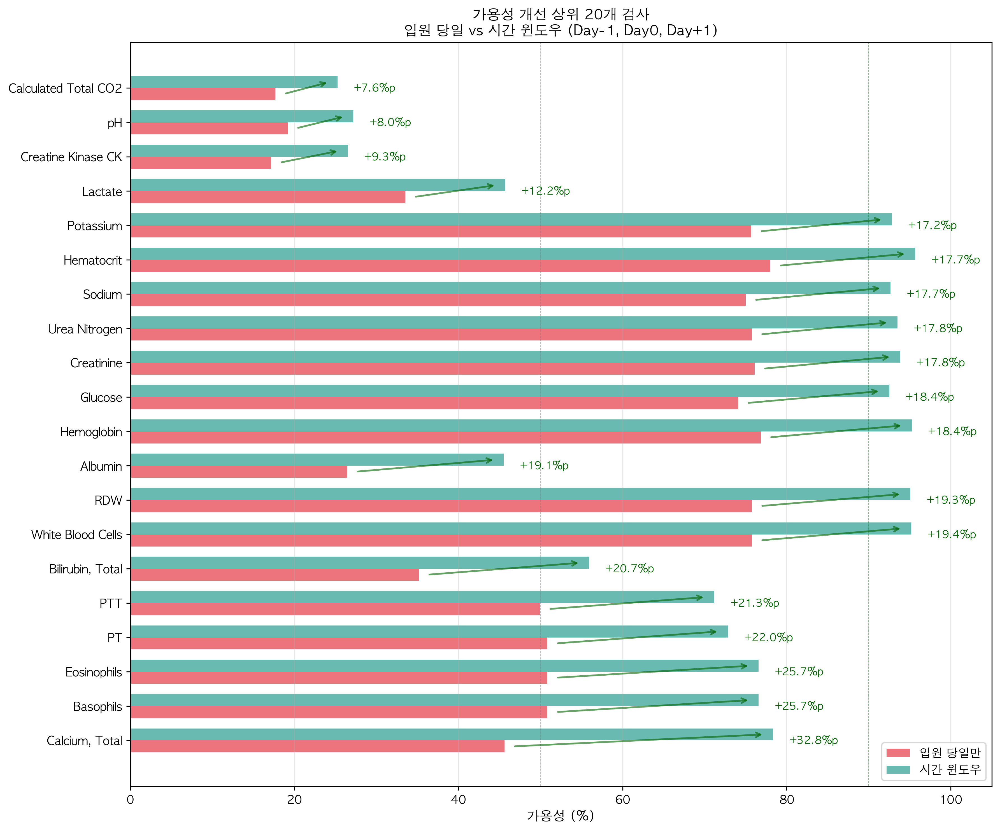
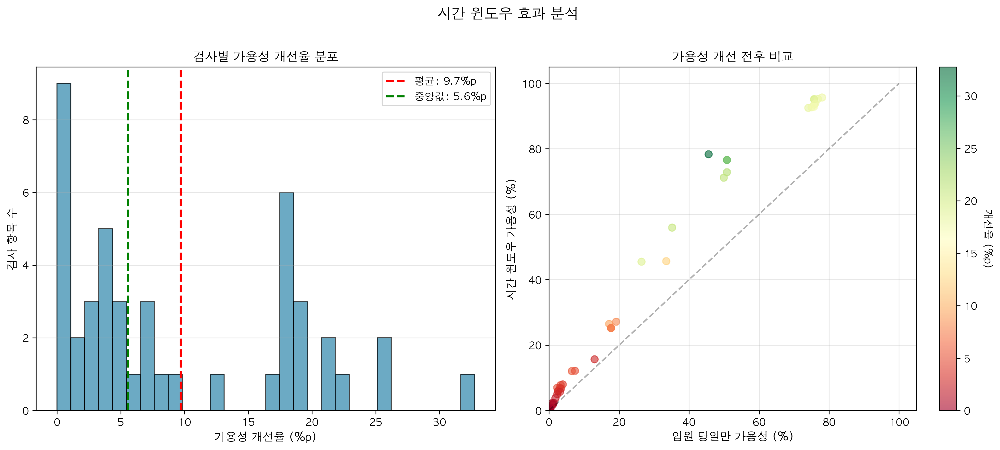

# 시간 윈도우를 적용한 혈액검사 데이터 추출 분석 보고서

## 요약

본 보고서는 입원 전일(-1), 당일(0), 익일(+1)의 3일 시간 윈도우를 적용하여 혈액검사 데이터를 추출한 결과를 분석합니다. 
이 접근법으로 데이터 가용성이 87.8%에서 96.2%로 향상되었으며, 검사가 없는 입원이 147건에서 45건으로 크게 감소했습니다.

---

## 1. 방법론

### 1.1 시간 윈도우 정의
- **입원 전일 (Day-1)**: 입원 24시간 전 검사 (주로 응급실/외래)
- **입원 당일 (Day0)**: 입원일 당일 검사 (기준)
- **입원 익일 (Day+1)**: 입원 다음날 검사 (아침 루틴)

### 1.2 우선순위 규칙
```
우선순위: 입원 당일 > 입원 전일 > 입원 익일
```
- 각 검사 항목별로 가장 우선순위가 높은 날짜의 값을 선택
- 동일 날짜에 여러 검사가 있으면 첫 번째 값 사용

### 1.3 구현 방법 (scripts/analysis/extract_labs_with_time_window.py)
```python
# 3일 윈도우 날짜 계산
date_minus1 = admit_date - timedelta(days=1)
date_plus1 = admit_date + timedelta(days=1)

# 우선순위 적용
if 당일 데이터 존재:
    사용 = 당일 데이터
elif 전일 데이터 존재:
    사용 = 전일 데이터
elif 익일 데이터 존재:
    사용 = 익일 데이터
```

---

## 2. 주요 결과

### 2.1 전체 가용성 개선

#### "검사 있는 입원"의 정의
- **정의**: 98개 주요 혈액검사 중 최소 1개 이상의 검사 결과가 있는 입원
- **판단 기준**: 검사 종류와 관계없이 1개라도 측정값이 있으면 "검사 있음"으로 분류
- **예시**: 
  - Sodium만 측정 → "검사 있는 입원"
  - 98개 검사 모두 결측 → "검사 없는 입원"

| 지표 | 당일만 | 시간 윈도우 | 개선 |
|------|--------|------------|------|
| 검사 있는 입원 | 1,053건 (87.8%) | 1,155건 (96.2%) | +102건 (+8.5%p) |
| 검사 없는 입원 | 147건 (12.2%) | 45건 (3.8%) | -102건 (-8.5%p) |
| 평균 검사 수 | 13.7개 | 16.8개 | +3.1개 |
| 추출된 레코드 | 14,550건 | 20,118건 | +5,568건 (+38.3%) |

### 2.2 데이터 출처 분포

#### 비율 계산 기준 설명
- **분모**: 시간 윈도우로 수집된 전체 검사 레코드 수 (20,118건)
- **의미**: 각 날짜에서 가져온 검사 데이터의 비중
- **주의**: 이는 1,200개 입원 비율이 아닌, 20,118개 개별 검사 레코드의 출처 비율

| 출처 | 레코드 수 | 전체 검사 중 비율 | 임상적 의미 |
|------|-----------|-----------------|-------------|
| 입원 당일 (Day0) | 16,593건 | 82.5% | 입원 시 표준 검사 |
| 입원 익일 (Day+1) | 2,460건 | 12.2% | 아침 루틴 검사 |
| 입원 전일 (Day-1) | 1,065건 | 5.3% | 응급실/외래 검사 |
| **합계** | **20,118건** | **100%** | - |

**주요 발견**:
- 20,118개 검사 중 16,593개(82.5%)는 여전히 입원 당일 데이터
- 시간 윈도우로 추가된 3,525개 검사(17.5%)가 데이터 완성도 향상에 기여
- 익일 검사(2,460건)가 전일 검사(1,065건)보다 2배 이상 많음

---

## 3. 검사별 상세 분석 (1,200개 입원 기준)

### 3.1 가용성 개선 상위 10개 검사

**중요**: 모든 수치는 1,200개 입원을 기준으로 한 절대값입니다.

| 검사명 | 당일만 | 시간 윈도우 | 개선 | 데이터 출처 (실제 건수) |
|--------|--------|------------|------|------------------------|
| Hematocrit | 936건 (78.0%) | 1,148건 (95.7%) | +212건 (+17.7%p) | Day0: 1,028건, Day-1: 52건, Day+1: 68건 |
| Hemoglobin | 922건 (76.8%) | 1,143건 (95.2%) | +221건 (+18.4%p) | Day0: 994건, Day-1: 57건, Day+1: 92건 |
| White Blood Cells | 909건 (75.8%) | 1,142건 (95.2%) | +233건 (+19.4%p) | Day0: 1,015건, Day-1: 53건, Day+1: 74건 |
| RDW | 909건 (75.8%) | 1,141건 (95.1%) | +232건 (+19.3%p) | Day0: 1,015건, Day-1: 53건, Day+1: 73건 |
| Creatinine | 913건 (76.1%) | 1,126건 (93.8%) | +213건 (+17.7%p) | Day0: 998건, Day-1: 50건, Day+1: 78건 |
| Urea Nitrogen | 909건 (75.8%) | 1,122건 (93.5%) | +213건 (+17.8%p) | Day0: 996건, Day-1: 49건, Day+1: 77건 |
| Potassium | 908건 (75.7%) | 1,114건 (92.8%) | +206건 (+17.2%p) | Day0: 986건, Day-1: 45건, Day+1: 83건 |
| Sodium | 900건 (75.0%) | 1,112건 (92.7%) | +212건 (+17.7%p) | Day0: 980건, Day-1: 45건, Day+1: 87건 |
| Glucose | 889건 (74.1%) | 1,110건 (92.5%) | +221건 (+18.4%p) | Day0: 935건, Day-1: 53건, Day+1: 122건 |
| PT | 610건 (50.8%) | 874건 (72.8%) | +264건 (+22.0%p) | Day0: 715건, Day-1: 45건, Day+1: 114건 |

**주요 패턴**:
- 기본 검사(CBC, BMP)는 이미 높은 가용성(75-78%)에서 95% 수준으로 개선
- 실제 추가된 입원 건수는 200-260건 범위
- PT/PTT 등 응고검사는 가장 큰 개선폭 (+22.0%p)

### 3.2 가장 큰 개선을 보인 검사 (절대값 기준)

| 검사명 | 입원 당일만 | 시간 윈도우 | 개선 | 임상적 의미 |
|--------|------------|------------|------|-------------|
| Calcium, Total | 547건 (45.6%) | 940건 (78.3%) | +393건 (+32.8%p) | 전해질 평가 |
| Basophils | 610건 (50.8%) | 919건 (76.6%) | +309건 (+25.8%p) | 면역세포 평가 |
| Eosinophils | 610건 (50.8%) | 919건 (76.6%) | +309건 (+25.8%p) | 알레르기/기생충 평가 |
| PT | 610건 (50.8%) | 874건 (72.8%) | +264건 (+22.0%p) | 수술 전 응고검사 |
| PTT | 599건 (49.9%) | 854건 (71.2%) | +255건 (+21.3%p) | 응고 기능 평가 |

### 3.3 시각화: 가용성 개선 분석

#### 검사별 가용성 변화

*그림 1: 시간 윈도우 적용에 따른 검사별 가용성 변화 (전체 98개 검사를 3개 그룹으로 분류)*
- 생성 스크립트: `scripts/analysis/create_missing_rate_comparison.py:92-146`
- X축: 가용성 (%)
- Y축: 검사 항목명
- 주요 패턴: 대부분의 검사에서 5-30%p의 가용성 개선

#### 상위 20개 검사 개선 효과

*그림 2: 가용성 개선 상위 20개 검사의 전후 비교*
- 생성 스크립트: `scripts/analysis/create_missing_rate_comparison.py:148-198`
- 녹색 화살표: 개선 방향
- 빨간색 텍스트: 개선율 (%p)

#### 개선율 분포

*그림 3: 전체 검사의 가용성 개선율 분포 및 산점도*
- 생성 스크립트: `scripts/analysis/create_missing_rate_comparison.py:200-250`
- 왼쪽: 개선율 히스토그램 (평균 9.7%p)
- 오른쪽: 개선 전후 산점도 (대각선 위 = 개선)

---

## 4. 입원별 분석

### 4.1 검사 수 분포 변화

| 검사 수 범위 | 당일만 | 시간 윈도우 | 변화 |
|-------------|--------|------------|------|
| 0개 | 147 (12.2%) | 45 (3.8%) | -102 |
| 1-10개 | 213 (17.8%) | 132 (11.0%) | -81 |
| 11-20개 | 620 (51.7%) | 585 (48.8%) | -35 |
| 21-30개 | 214 (17.8%) | 382 (31.8%) | +168 |
| 31개 이상 | 6 (0.5%) | 56 (4.7%) | +50 |

**통계**:
- 평균: 13.7개 → 16.8개 (+3.1개)
- 중앙값: 15개 → 18개 (+3개)
- 최대: 38개 → 45개 (+7개)

### 4.2 완전 결측 입원 분석 (45건)

완전 결측으로 남은 45건의 특성:
- **짧은 입원**: 24시간 이내 퇴원/전원
- **DNR/Comfort care**: 적극적 치료 포기
- **즉시 수술**: 검사 없이 응급 수술
- **외부 전원**: 타 병원에서 검사 완료

---

## 5. 임상적 의미

### 5.1 1,200개 입원 기준 데이터 출처 해석

#### 검사가 있는 1,155건 입원의 데이터 출처
- **입원 당일 (Day0)**: 대부분의 검사가 여기서 시행
- **입원 전일 (Day-1)**: 주로 응급실/외래에서 시행한 검사 활용
- **입원 익일 (Day+1)**: 아침 루틴 검사로 보완

#### 구체적 예시: Hematocrit
- 1,200개 입원 중 1,148건(95.7%)에서 검사 가능
- 이 중 1,028건은 입원 당일 검사
- 52건은 입원 전일 검사 활용
- 68건은 입원 익일 검사로 보완

### 5.2 시간 윈도우 적용의 타당성

**장점**:
1. **포괄성**: 96.2% 입원에서 검사 데이터 확보
2. **연속성**: 입원 전후 상태 파악 가능
3. **실용성**: 실제 임상 프로세스 반영

**제한점**:
1. **시간 순서**: 치료 전후 구분 어려움
2. **상태 변화**: 24-48시간 내 급격한 변화 가능
3. **검사 목적**: 응급/루틴/추가 검사 구분 필요

---

## 6. 머신러닝 모델링 고려사항

### 6.1 특징 공학 (Feature Engineering)

```python
# 데이터 출처를 특징으로 활용
features = {
    'lab_value': 검사 수치,
    'lab_day_offset': -1/0/1 (출처 날짜),
    'lab_from_emergency': Day-1 여부,
    'lab_from_routine': Day+1 여부
}
```

### 6.2 모델링 전략

#### Option 1: 단일 모델
- 모든 데이터를 통합하여 사용
- day_offset을 특징으로 포함
- 장점: 간단, 데이터 활용 극대화
- 단점: 시간 정보 손실 가능

#### Option 2: 앙상블 모델
- Day0 모델 + 시간 윈도우 모델
- 가중 평균 또는 스태킹
- 장점: 데이터 출처별 패턴 학습
- 단점: 복잡도 증가

### 6.3 검증 전략
- **시간 기반 분할**: 입원 시간 순서로 train/test 분할
- **교차 검증**: day_offset 분포 유지
- **성능 비교**: 당일만 vs 시간 윈도우 모델

---

## 7. 권장사항

### 7.1 데이터 수집 개선
1. **표준화**: 입원 24시간 내 필수 검사 프로토콜
2. **시간 기록**: 검사 시행 정확한 시간 기록
3. **목적 표시**: 응급/루틴/추가 검사 구분

### 7.2 분석 개선
1. **가중치 적용**: 데이터 출처별 신뢰도 가중치
2. **시계열 분석**: 검사 시행 시간 패턴 분석
3. **결측 패턴**: 완전 결측 45건 심층 분석

### 7.3 모델 개발
1. **기준 모델**: 시간 윈도우 데이터로 baseline 설정
2. **특징 중요도**: day_offset의 예측력 평가
3. **해석 가능성**: 데이터 출처별 기여도 분석

---

## 8. 결론

시간 윈도우 접근법으로 1,200개 입원 중:
- **102건(8.5%)의 추가 입원**에서 검사 데이터 확보
- **검사가 있는 입원**: 1,053건 → 1,155건
- **검사가 없는 입원**: 147건 → 45건 (69% 감소)

### 핵심 성과
- **데이터 손실 최소화**: 완전 결측 147건 → 45건 (69% 감소)
- **정보량 증가**: 평균 검사 수 13.7개 → 16.8개 (+23%)
- **실용성**: 실제 임상 프로세스 반영

### 주의사항
- 82.5%는 여전히 입원 당일 데이터
- 시간 순서와 치료 효과 고려 필요
- 데이터 출처를 특징으로 활용 권장

이 접근법은 MIMIC-IV 데이터를 활용한 예측 모델 개발에서 데이터 완성도를 크게 개선하며, 
특히 입원 초기 위험도 평가 모델에 적합합니다.

---

## 부록

### A. 파일 구조
```
analysis_initial_lab/
├── scripts/analysis/
│   └── extract_labs_with_time_window.py    # 시간 윈도우 추출 스크립트
├── data/
│   ├── labs_time_window_long.csv           # Long format (20,118 레코드)
│   ├── labs_time_window_wide.csv           # Wide format (1,200 × 98)
│   ├── lab_source_days.csv                 # 데이터 출처 정보
│   └── lab_statistics_time_window.json     # 통계 정보
└── figures/
    ├── time_window_effect.png              # 시간 윈도우 효과 분석
    └── availability_comparison.png         # 가용성 비교 히트맵
```

### B. 주요 통계 요약
```json
{
  "total_admissions": 1200,
  "admissions_with_labs": 1155,
  "coverage_rate": 96.25,
  "time_window_effect": {
    "day_minus1": 1065 (5.3%),
    "day0": 16593 (82.5%),
    "day_plus1": 2460 (12.2%)
  }
}
```

---

*작성일: 2025-08-19 (2025-08-20 업데이트: 1,200개 입원 기준 절대값으로 재분석)*  
*분석 도구: Python 3.x, pandas*  
*데이터: MIMIC-IV 샘플 1,200건*