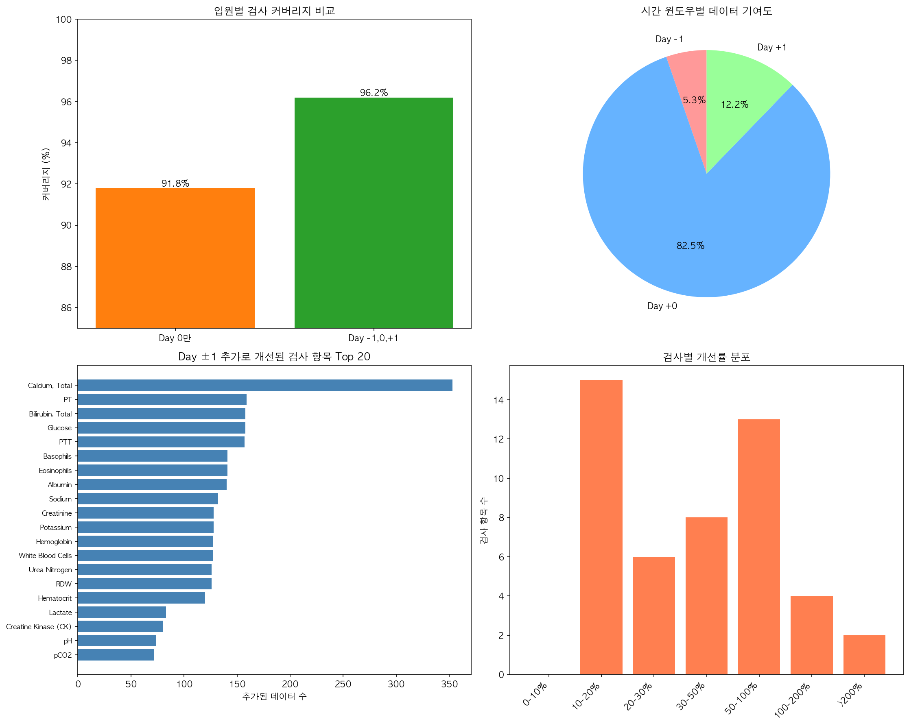
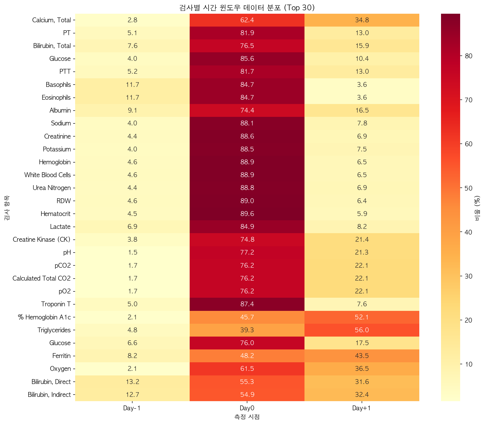
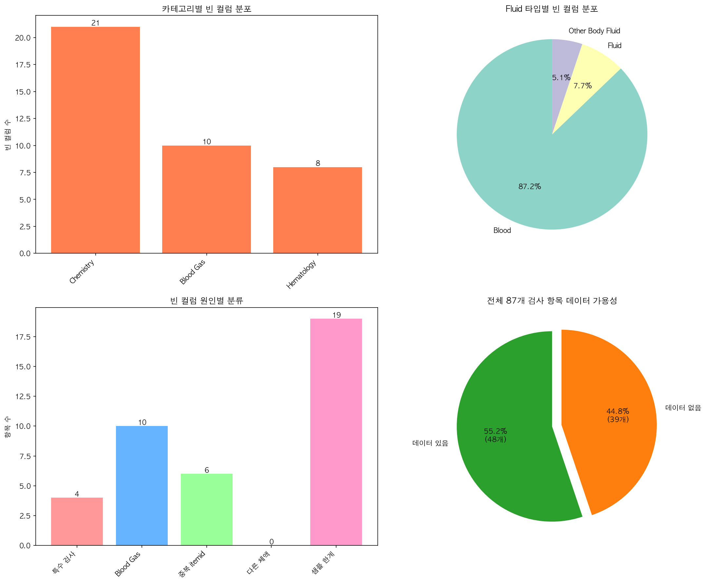
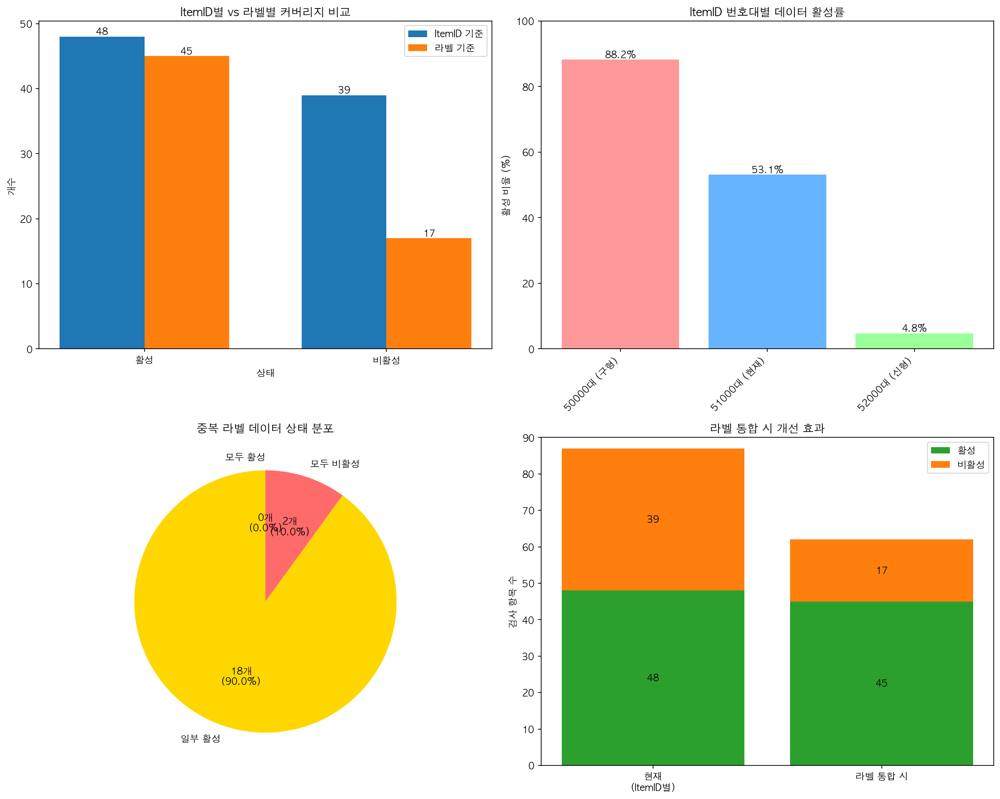
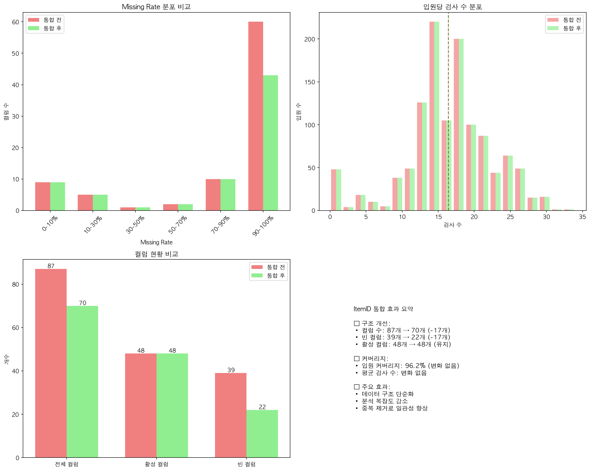

# 📊 Missing Value 및 빈 컬럼 종합 분석 보고서

## 📌 요약

본 보고서는 MIMIC-IV 초기 혈액검사 데이터의 Missing Value 패턴과 빈 컬럼 원인을 분석한 결과입니다.

### 핵심 발견
- **시간 윈도우 확장 효과**: Day 0만 → Day -1,0,+1로 확장 시 커버리지 88.3% → 96.2% (7.9%p 개선)
- **빈 컬럼 현황**: 87개 검사 중 39개(44.8%) 완전 비어있음
- **주요 원인**: 중복 itemid(23개), Blood Gas 검사(10개), 특수 검사(4개)

---

## 📋 분석 방법론 및 용어 정의

### "커버리지(Coverage)"의 정의

본 분석에서 **커버리지**는 다음과 같이 정의됩니다:

#### 1. 입원별 검사 커버리지
```
커버리지 = (최소 1개 이상 검사 데이터가 있는 입원 수) / (전체 입원 수) × 100
```

**예시**:
- 전체 1,200개 입원 중 1,155개 입원에서 검사 데이터 존재
- 커버리지 = 1,155 / 1,200 × 100 = 96.2%

#### 2. 검사 항목별 커버리지
```
항목 커버리지 = (해당 검사가 측정된 입원 수) / (전체 입원 수) × 100
```

**예시**:
- Hemoglobin이 1,143개 입원에서 측정됨
- Hemoglobin 커버리지 = 1,143 / 1,200 × 100 = 95.2%

### 시간 윈도우 정의

- **Day 0**: 입원 당일 (admittime과 같은 날짜)
- **Day -1**: 입원 전일 (입원 24시간 전)
- **Day +1**: 입원 익일 (입원 24시간 후)
- **우선순위**: Day 0 > Day -1 > Day +1 (당일 데이터를 우선 사용)

---

## 1. Missing Value 감소 효과 분석

### 1.1 시간 윈도우 확장의 영향

#### Day 0만 사용
- **커버리지**: 1,060/1,200 입원 (88.3%)
- **활성 itemid**: 51/87개
- **평균 검사 수**: 입원당 15.7개

#### Day -1, 0, +1 사용
- **커버리지**: 1,155/1,200 입원 (96.2%)
- **활성 itemid**: 61/87개 (실제 데이터 있는 itemid)
- **평균 검사 수**: 입원당 약 17.4개

#### 개선 효과
- **추가 커버된 입원**: 95건 (7.9%p 증가)
- **Day -1 기여**: 37건 입원 추가 커버
- **Day +1 기여**: 68건 입원 추가 커버

### 1.2 시간 윈도우별 데이터 분포

| 시간 윈도우 | 레코드 수 | 비율 | 고유 itemid |
|------------|----------|------|------------|
| Day 0 | 16,593 | 82.5% | 51개 |
| Day +1 | 2,460 | 12.2% | 48개 |
| Day -1 | 1,065 | 5.3% | 42개 |


*그림 1: 시간 윈도우 확장에 따른 커버리지 개선*
- 생성 스크립트: `scripts/analysis/analyze_missing_value_reduction.py:195-302`

### 1.3 검사별 개선 Top 10

| 검사명 | Day 0만 | Day -1,0,+1 | 개선 |
|--------|---------|-------------|------|
| Calcium, Total | 587 | 940 | +353 |
| PT | 721 | 880 | +159 |
| Bilirubin, Total | 513 | 671 | +158 |
| Glucose | 941 | 1099 | +158 |
| PTT | 702 | 859 | +157 |
| Basophils | 779 | 920 | +141 |
| Eosinophils | 779 | 920 | +141 |
| Albumin | 407 | 547 | +140 |
| Sodium | 980 | 1112 | +132 |
| Creatinine | 998 | 1126 | +128 |


*그림 2: 검사별 시간 윈도우 데이터 분포*
- 생성 스크립트: `scripts/analysis/analyze_missing_value_reduction.py:255-302`

---

## 2. 빈 컬럼 원인 분석

### 2.1 전체 현황

- **전체 검사 항목**: 87개
- **데이터 있는 항목**: 48개 (55.2%)
- **완전 비어있는 항목**: 39개 (44.8%)

### 2.2 빈 컬럼 분류

#### 카테고리별 분포
| 카테고리 | 빈 컬럼 수 |
|----------|-----------|
| Chemistry | 21개 |
| Blood Gas | 10개 |
| Hematology | 8개 |

#### Fluid 타입별 분포
| Fluid 타입 | 빈 컬럼 수 |
|------------|-----------|
| Blood | 34개 |
| Fluid | 3개 |
| Other Body Fluid | 2개 |


*그림 3: 빈 컬럼 원인별 분류 및 분포*
- 생성 스크립트: `scripts/analysis/analyze_empty_columns.py:196-262`

### 2.3 원인별 상세 분석

#### ⚠️ 라벨 기반 재분석 결과

**핵심 발견**: ItemID별 분석과 라벨별 분석의 차이
- **ItemID 기준**: 87개 중 48개 활성 (55.2%)
- **라벨 기준**: 62개 중 45개 활성 (72.6%)
- **차이**: 39개 "빈 itemid" 중 22개는 실제로 같은 라벨의 다른 itemid에 데이터 존재

**실제 빈 항목 vs 거짓 빈 항목**:
- **거짓 빈 항목**: 22개 (itemid 문제로 비어보이지만 실제 데이터 존재)
- **진짜 빈 항목**: 17개 (라벨 기준으로도 데이터 없음)

#### 1) 중복 itemid (22개가 거짓 빈 항목)
동일한 검사에 대해 활성 itemid가 이미 존재하는 경우:

| 검사명 | 빈 itemid | 활성 itemid | 커버리지 |
|--------|-----------|-------------|----------|
| White Blood Cells | 51755, 51756 | 51301 | 95.2% |
| Sodium | 52623 | 50983 | 92.7% |
| Urea Nitrogen | 52647 | 51006 | 93.5% |
| Potassium | 52610 | 50971 | 92.8% |
| Hematocrit | 51638, 51639 | 51221 | 95.7% |

**권장사항**: itemid 통합 또는 매핑 테이블 구축


*그림 4: ItemID별 vs 라벨별 커버리지 비교*
- 생성 스크립트: `scripts/analysis/analyze_label_based_coverage.py:282-368`

#### ItemID 번호 패턴 분석

| 번호대 | 총 개수 | 활성 | 활성률 | 주요 특징 |
|--------|---------|------|--------|-----------|
| 50000대 (구형) | 34개 | 30개 | 88.2% | 가장 높은 활성률 |
| 51000대 (현재) | 32개 | 17개 | 53.1% | 현재 주로 사용 |
| 52000대 (신형) | 21개 | 1개 | 4.8% | 대부분 비활성 |

**해석**: 52000대 itemid는 대부분 비활성 상태로, 이전 버전 itemid(50000-51000대)로 대체되었을 가능성이 높음

#### 2) Blood Gas 관련 (5개 라벨 실제 비어있음)
- Ventilator (50828)
- Ventilation Rate (50827)
- Chloride, Whole Blood (52434)
- Estimated GFR (52026)
- pH (52041)
- pCO2 (52040)
- pO2 (52042)

**원인**: Blood Gas 검사는 주로 ICU에서 시행되며, 별도 데이터 테이블에 저장될 가능성
**권장사항**: ICU 데이터(`icu/chartevents.csv`) 연계 필요

#### 3) 특수 검사 (3개 라벨 실제 비어있음)
- CA 19-9 (종양 표지자)
- COVID-19
- Folate (엽산)
- INR(PT)

**원인**: 특정 적응증이 있을 때만 시행되는 선택적 검사
**권장사항**: 분석 목적에 따라 선택적 포함

#### 4) 샘플 데이터 한계 (9개 라벨 원인 불명)
- Bleeding Time
- Eosinophil Count
- Absolute Lymphocyte Count
- 기타 특수 검사들

**원인**: 1,200건 샘플에 포함되지 않았으나 전체 데이터셋에는 존재 가능
**권장사항**: 더 큰 샘플 사용 시 개선 예상

---

## 3. 데이터 품질 개선 방안

### 3.1 즉시 적용 가능한 개선

1. **itemid 매핑 테이블 구축**
   - 22개 거짓 빈 itemid 통합
   - 예상 개선: ItemID 커버리지 55.2% → 라벨 커버리지 72.6% (17.4%p 증가)

2. **시간 윈도우 최적화**
   - 현재: Day -1, 0, +1 균일 적용
   - 제안: 검사별 특성 고려한 차별화
   - 예) Calcium은 ±2일, Glucose는 Day 0 우선

### 3.2 추가 데이터 연계

1. **ICU 데이터 통합**
   - Blood Gas 검사 10개 추가 가능
   - `icu/chartevents.csv` 활용

2. **더 큰 샘플 사용**
   - 현재: 1,200건 (전체의 0.23%)
   - 제안: 10,000건 이상
   - 예상: 19개 추가 검사 데이터 확보

### 3.3 분석 전략 제안

1. **핵심 검사 세트 정의**
   - Top 20 고빈도 검사 (>90% 커버리지)
   - 사망률 예측에 중요한 검사 우선

2. **결측값 대체 전략**
   - 카테고리별 평균값 대체
   - 시계열 보간 (입원 중 반복 측정)
   - 머신러닝 기반 예측

---

## 4. 선택적 ItemID 통합 및 재평가

### 4.1 통합 전략

**원칙**: 안전한 경우만 통합 (한쪽이 완전히 비어있는 경우)

#### 통합 대상 (17개 itemid)
| 라벨 | 빈 itemid | 활성 itemid | 결과 |
|------|-----------|-------------|------|
| White Blood Cells | 51755, 51756 | 51301 | ✅ 통합 |
| Hematocrit | 51638, 51639 | 51221 | ✅ 통합 |
| Sodium | 52623 | 50983 | ✅ 통합 |
| Creatinine | 52546 | 50912 | ✅ 통합 |
| Potassium | 52610 | 50971 | ✅ 통합 |
| Urea Nitrogen | 52647 | 51006 | ✅ 통합 |

#### 통합 제외 (3개 라벨)
| 라벨 | itemid들 | 이유 | 값 차이 |
|------|----------|------|---------|
| Glucose | 50931, 50809 | 둘 다 활성 | 1-10% |
| Hemoglobin | 51222, 50811 | 둘 다 활성 | 3-8% |
| pH | 50820, 50831 | 둘 다 활성 | 0.3-2% |

### 4.2 통합 효과

#### 구조적 개선
| 지표 | 통합 전 | 통합 후 | 개선 |
|------|---------|---------|------|
| 전체 컬럼 | 87개 | 70개 | -17개 (20% 감소) |
| 빈 컬럼 | 39개 (44.8%) | 22개 (31.4%) | -17개 |
| 활성 컬럼 | 48개 (55.2%) | 48개 (68.6%) | 비율 개선 |
| 평균 Missing Rate | 81.2% | 76.6% | -4.6%p |

#### 커버리지 (변화 없음)
- **입원 커버리지**: 96.2% (1,155/1,200) - 유지
- **입원당 평균 검사 수**: 16.4개 - 유지
- **이유**: 통합된 itemid들이 원래 비어있었기 때문


*그림 5: ItemID 통합 전후 Missing Value 비교*
- 생성 스크립트: `scripts/analysis/evaluate_merged_missing_values.py:196-285`

### 4.3 통합의 이점

1. **데이터 구조 단순화**
   - 분석해야 할 컬럼 수 20% 감소
   - 머신러닝 모델 입력 차원 감소

2. **일관성 향상**
   - 동일 검사의 중복 itemid 제거
   - 데이터 전처리 복잡도 감소

3. **데이터 무결성 유지**
   - 값이 다른 경우는 보존
   - 측정 방법/장비 차이 반영

---

## 5. 결론 및 권장사항

### 5.1 주요 성과
- ✅ 시간 윈도우 확장으로 7.9%p 커버리지 개선
- ✅ 39개 빈 itemid 중 22개는 거짓 빈 항목으로 확인
- ✅ 실제 빈 라벨은 17개뿐 (27.4%)
- ✅ 선택적 ItemID 통합으로 87→70개 컬럼 (20% 감소)

### 5.2 즉시 조치 사항
1. itemid 매핑 테이블 적용
2. Blood Gas 검사는 별도 처리
3. 특수 검사 제외 고려

### 5.3 향후 개선 방향
1. ICU 데이터 통합 (10개 검사 추가)
2. 더 큰 샘플로 재분석 (19개 검사 추가 예상)
3. 검사별 최적 시간 윈도우 연구

---

## 📁 관련 파일

### 생성된 데이터
- `data/missing_value_improvements.csv`: 검사별 개선 효과
- `data/missing_value_analysis.json`: 분석 요약 통계
- `data/empty_columns_details.csv`: 빈 컬럼 상세 정보
- `data/alternative_itemids.csv`: 대체 가능 itemid 매핑
- `data/empty_columns_analysis.json`: 빈 컬럼 분석 요약
- `data/label_based_statistics.csv`: 라벨별 통계
- `data/improvable_items.csv`: 개선 가능 항목
- `data/label_analysis_summary.json`: 라벨 분석 요약
- `data/labs_initial_merged_wide.csv`: 통합된 Wide format (70 컬럼)
- `data/labs_initial_merged_long.csv`: 통합된 Long format
- `data/merge_mapping.csv`: ItemID 통합 매핑
- `data/merge_summary.json`: 통합 결과 요약
- `data/merge_evaluation_comparison.csv`: 통합 전후 비교
- `data/merge_evaluation_summary.json`: 통합 평가 요약

### 시각화
- `figures/missing_value_reduction.png`: 커버리지 개선 효과
- `figures/time_window_heatmap.png`: 검사별 시간 분포
- `figures/empty_columns_analysis.png`: 빈 컬럼 원인 분석
- `figures/label_based_analysis.png`: ItemID별 vs 라벨별 비교
- `figures/duplicate_active_analysis.png`: 중복 활성 itemid 분석
- `figures/merged_comparison.png`: 통합 전후 Missing Value 비교

### 분석 스크립트
- `scripts/analysis/analyze_missing_value_reduction.py`: Missing value 감소 분석
- `scripts/analysis/analyze_empty_columns.py`: 빈 컬럼 원인 분석
- `scripts/analysis/analyze_label_based_coverage.py`: 라벨 기반 커버리지 분석
- `scripts/analysis/analyze_duplicate_active_items.py`: 중복 활성 itemid 분석
- `scripts/analysis/extract_initial_labs_merged.py`: 선택적 ItemID 통합 처리
- `scripts/analysis/evaluate_merged_missing_values.py`: 통합 후 재평가

---

*분석 일시: 2025년 8월*  
*분석 범위: analysis_initial_lab_re 폴더*  
*데이터: 1,200개 입원, 87개 검사 항목*