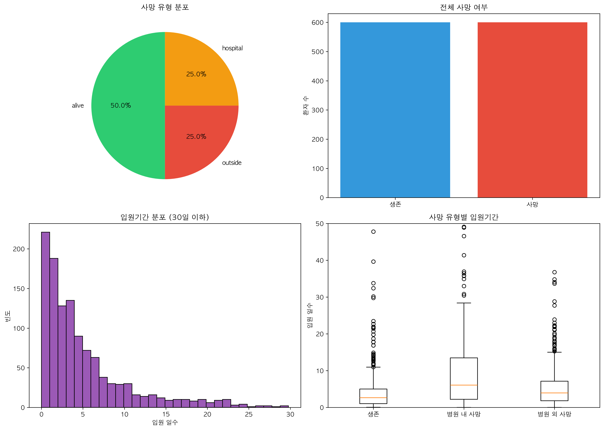

# 예측 모델용 통합 데이터셋

## 📌 개요
MIMIC-IV 데이터셋을 기반으로 사망률 예측과 입원기간 예측을 위한 통합 데이터셋을 구축합니다. 입원 당일 혈액검사 결과와 환자 정보를 결합하여 머신러닝 모델 개발에 적합한 형태로 데이터를 준비합니다.

## 🎯 분석 목표
- 목표 1: 사망 예측을 위한 타겟 변수 정의 (병원 내/외 사망 구분)
- 목표 2: 입원기간 예측을 위한 연속형 타겟 변수 생성
- 목표 3: 머신러닝 모델에 즉시 사용 가능한 통합 데이터셋 제공

## 📋 분석 방법론

### "예측 타겟"의 정의
본 데이터셋에서는 3가지 예측 타겟을 제공합니다:

1. **사망 유형 (death_type)**:
   - `alive`: 생존 (dod가 없음)
   - `hospital`: 병원 내 사망 (hospital_expire_flag = 1)
   - `outside`: 병원 외 사망 (hospital_expire_flag = 0 & dod 존재)

2. **이진 사망 (death_binary)**:
   - 0: 생존
   - 1: 사망 (병원 내외 무관)

3. **입원기간 (los_hours/los_days)**:
   - 입원시각(admittime)부터 퇴원시각(dischtime)까지의 시간
   - 시간 단위(los_hours)와 일 단위(los_days) 제공

#### 구체적 예시
- 병원 내 사망: ICU에서 사망한 환자 → death_type='hospital'
- 병원 외 사망: 퇴원 후 1년 뒤 사망 → death_type='outside'
- 장기 입원: 30일 이상 입원 → los_days > 30

## 📊 사용 데이터
| 파일명 | 설명 | 사용 변수 |
|--------|------|----------|
| `../analysis_initial_lab_re/data/labs_initial_merged_wide.csv` | 입원 당일 혈액검사 | 70개 검사 항목 |
| `../dataset2/core/admissions.csv` | 입원 정보 | dischtime, admission_type |
| `../dataset2/core/patients.csv` | 환자 정보 | dod, gender, anchor_age |

## 🔧 주요 코드 설명

### 데이터 통합 프로세스 (scripts/analysis/prepare_prediction_data.py)

1. **사망 구분 로직** (lines 59-79):
```python
# 사망 유형 분류
df['death_type'] = 'alive'  # 기본값
df.loc[hospital_expire_flag == 1, 'death_type'] = 'hospital'
df.loc[(hospital_expire_flag == 0) & dod.notna(), 'death_type'] = 'outside'
```

2. **입원기간 계산** (lines 91-95):
```python
# 시간 단위 계산
los_hours = (dischtime - admittime).total_seconds() / 3600
los_days = los_hours / 24
```

## 🚀 실행 방법

### 필요한 도구
- Python 3.8 이상
- pandas, numpy, matplotlib, seaborn 라이브러리

### 실행 명령
```bash
cd analysis_prediction
source ../.venv/bin/activate
python scripts/analysis/prepare_prediction_data.py
```

## 📈 결과 해석

### 데이터셋 구성
- **전체 크기**: 1,200행 × 81열
- **타겟 변수 분포**:
  - 생존: 600건 (50.0%)
  - 병원 내 사망: 300건 (25.0%)
  - 병원 외 사망: 300건 (25.0%)
- **평균 입원기간**: 6.39일 (표준편차: 10.48일)
- **평균 연령 (입원 시)**: 63.5세 (표준편차: 18.4세)

### 주요 특징
1. **균형잡힌 타겟 분포**: 원본 데이터의 불균형 문제 해결 (샘플링 적용)
2. **다양한 예측 타겟**: 분류(사망 유형)와 회귀(입원기간) 모두 가능
3. **완전한 특성 세트**: 70개 혈액검사 + 인구통계학적 정보

### 시각화 결과

*그림 1: 예측 타겟 변수들의 분포 - 사망 유형, 전체 사망, 입원기간, 사망별 입원기간*
- 생성 스크립트: `scripts/analysis/prepare_prediction_data.py:245-291`


*그림 2: 주요 변수 간 상관관계 - 타겟 변수와 주요 혈액검사 항목*
- 생성 스크립트: `scripts/analysis/prepare_prediction_data.py:293-324`

## 📊 변수 설명

### 식별자
- `hadm_id`: 입원 ID (고유값)
- `subject_id`: 환자 ID

### 타겟 변수
| 변수명 | 타입 | 설명 | 용도 |
|--------|------|------|------|
| `death_type` | 범주형 | 사망 유형 (alive/hospital/outside) | 다중 분류 |
| `death_binary` | 이진 | 전체 사망 여부 (0/1) | 이진 분류 |
| `hospital_death` | 이진 | 병원 내 사망 (0/1) | 이진 분류 |
| `los_hours` | 연속형 | 입원 시간 | 회귀 |
| `los_days` | 연속형 | 입원 일수 | 회귀 |

### 인구통계
- `age`: **입원 시점의 실제 나이** (anchor_age와 입원 연도를 고려하여 계산)
  - 계산식: 입원연도 - (anchor_year - anchor_age)
  - 주의: 89세 이상 환자는 프라이버시 보호를 위해 그룹화됨
- `gender`: 성별 (M/F)
- `admission_type`: 입원 유형

### 혈액검사 (70개 항목)
주요 항목 예시:
- `Creatinine_50912_merged`: 크레아티닌
- `Hemoglobin_51222`: 헤모글로빈
- `Platelet_Count_51704`: 혈소판 수
- `WBC_Count_51300`: 백혈구 수
- 기타 64개 검사 항목

## 🤖 머신러닝 모델 개발 가이드

### 추천 접근법

1. **사망 예측 (분류)**:
```python
# 이진 분류
X = df.drop(['death_binary', 'death_type', 'hospital_death', 
             'los_hours', 'los_days'], axis=1)
y = df['death_binary']

# 다중 분류
y_multi = df['death_type']
```

2. **입원기간 예측 (회귀)**:
```python
X = df.drop(['los_hours', 'los_days', 'death_type', 
             'death_binary', 'hospital_death'], axis=1)
y = df['los_days']
```

### 전처리 권장사항
- 결측치 처리: 중앙값 대체 또는 KNN Imputation
- 스케일링: StandardScaler 또는 MinMaxScaler
- 범주형 인코딩: One-hot encoding for gender, admission_type

## ⚠️ 분석의 제한점

### 1. 데이터 제한
- 샘플링된 1,200건만 포함 (전체 523,740건 중)
- 입원 당일 검사만 포함 (시계열 정보 없음)

### 2. 방법론적 제한
- 균형 샘플링으로 실제 사망률과 차이 존재
- 혈액검사 결측치가 많은 항목 존재

### 3. 해석상 주의점
- 이 데이터셋은 모델 개발용으로, 실제 배포 시에는 전체 데이터 사용 필요
- 병원 외 사망은 인과관계가 아닌 상관관계만 나타냄

## ❓ 자주 묻는 질문

**Q: 왜 균형잡힌 샘플링을 사용했나요?**
A: 원본 데이터의 사망률이 2.5%로 매우 낮아, 불균형 문제를 해결하기 위해 균형 샘플링을 적용했습니다.

**Q: 시계열 데이터는 어떻게 활용하나요?**
A: 현재 데이터셋은 입원 당일 스냅샷입니다. 시계열 예측이 필요한 경우 별도 데이터 준비가 필요합니다.

**Q: 더 많은 특성을 추가할 수 있나요?**
A: 네, dataset2 폴더의 다른 테이블(진단 코드, 약물 처방 등)을 추가로 병합할 수 있습니다.

## 📚 관련 문서

### 예측 모델 데이터셋
- **[Essential Dataset 분석](./Essential_Dataset_Analysis.md)** - 기본 변수 세트 (결측률 6%)
- **[Extended Dataset 분석](./Extended_Dataset_Analysis.md)** - 확장 변수 세트 (결측률 22%)
- **[Comprehensive Dataset 분석](./Comprehensive_Dataset_Analysis.md)** - 포괄적 변수 세트 (결측률 37%)

### 가이드 문서
- **[모델링 가이드](./Modeling_Guide.md)** - 예측 모델 개발 실용 가이드
- **[MIMIC-IV 나이 계산 가이드](./MIMIC_IV_Age_Calculation_Guide.md)** - anchor_age 이해와 정확한 나이 계산법

## 🔗 관련 분석
- [초기 혈액검사 분석](../analysis_initial_lab_re/README.md)
- [사망 데이터 분석](../analysis_death/README.md)
- [샘플링 방법론](../analysis_samplingmethod/README.md)