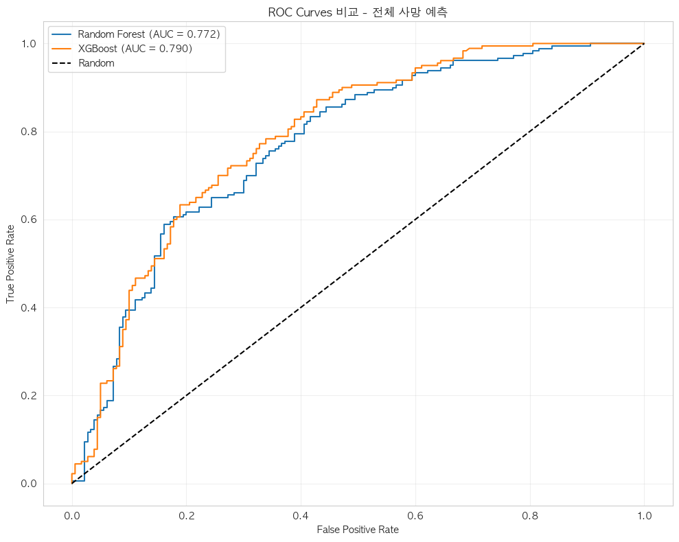
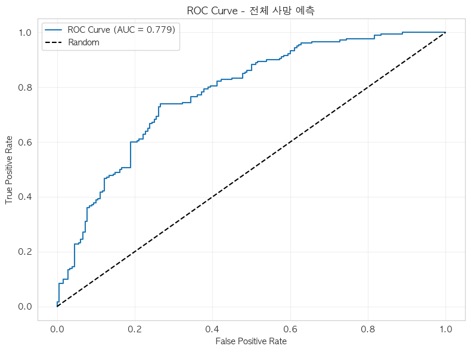
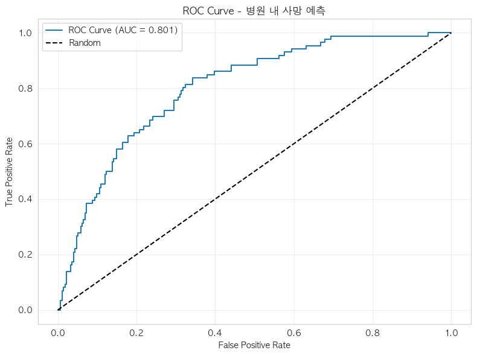
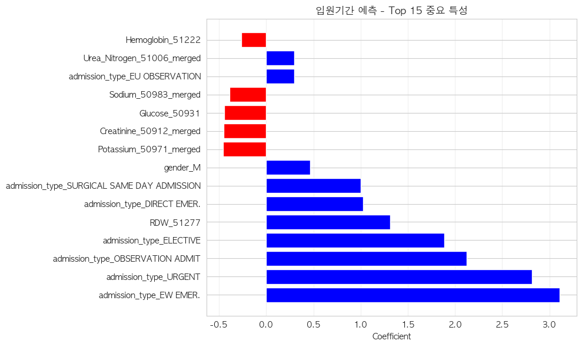
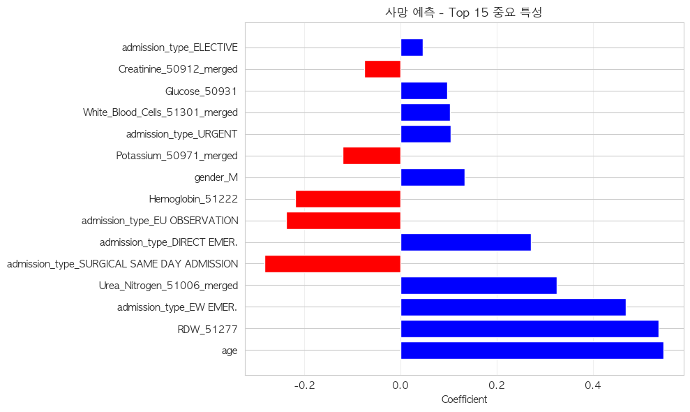
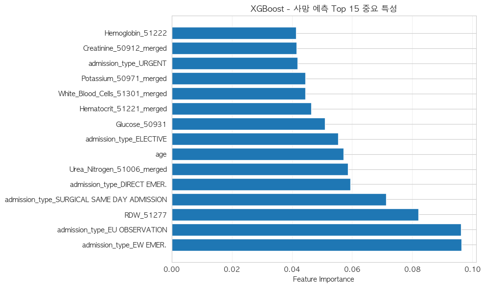
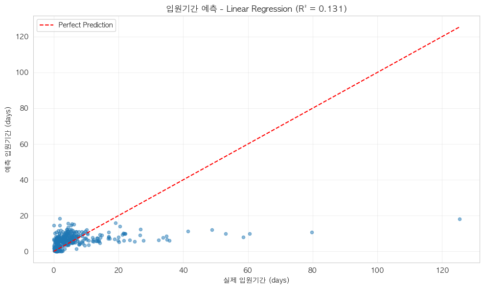
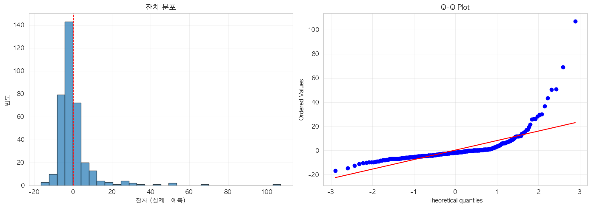

# Essential Dataset 모델링 분석 보고서

## 📌 개요

본 문서는 MIMIC-IV Essential 데이터셋을 활용한 사망률 및 입원기간 예측 모델링 결과를 종합적으로 분석합니다. 데이터 누출 문제의 발견과 해결, 모델 성능 비교, 그리고 의료 데이터 모델링의 특수성에 대한 통찰을 제공합니다.

## 🎯 모델링 목표

1. **사망 예측**: 
   - 전체 사망 (death_binary): 병원 내외 사망 모두 포함
   - 병원 내 사망 (hospital_death): 입원 중 사망만 포함

2. **입원기간 예측**:
   - 연속형 변수 (los_days)로 회귀 분석

3. **검증 방법**:
   - 시간 기반 분할 (70:30)로 실제 운영 환경 시뮬레이션

---

## 📊 데이터셋 특징

### 기본 정보
- **샘플 수**: 1,200개 (생존 600, 병원 내 사망 300, 병원 외 사망 300)
- **변수 수**: 23개 (식별자 2, 시간 정보 4, 타겟 5, 특성 12)
- **평균 결측률**: 약 6-8%

### 주요 변수 구성

| 카테고리 | 변수 | 설명 |
|---------|------|------|
| **인구통계** | age, gender, admission_type | 나이, 성별, 입원 유형 |
| **혈액검사** | Hematocrit, Hemoglobin, Creatinine | 적혈구, 헤모글로빈, 신장 기능 |
| **전해질** | Sodium, Potassium | 나트륨, 칼륨 |
| **기타** | RDW, WBC, Urea Nitrogen, Glucose | 적혈구 분포, 백혈구, 요소질소, 혈당 |

---

## ⚠️ 데이터 누출 Warning

> **주의**: 초기 모델에서 `hospital_expire_flag`가 특성으로 포함되어 AUROC 1.0이 나왔습니다.  
> 이는 타겟 변수와 동일한 정보였으며, 제거 후 정상적인 성능(AUROC 0.81)을 확인했습니다.

---

## 📈 모델 성능 비교

### 전체 사망 예측 (AUROC)

| 모델 | AUROC | F1 Score | 특징 |
|------|-------|----------|------|
| **XGBoost** | 0.7895 | 0.7189 | 최고 성능, 비선형 패턴 포착 |
| **Logistic Regression** | 0.7794 | 0.7318 | 안정적, 해석 가능 |
| **Random Forest** | 0.7717 | 0.7158 | 앙상블 효과 |

### 병원 내 사망 예측 (AUROC)

| 모델 | AUROC | F1 Score | 특징 |
|------|-------|----------|------|
| **Random Forest** | 0.8145 | 0.4160 | 최고 성능 |
| **XGBoost** | 0.8124 | 0.4762 | F1 Score 우수 |

### 입원기간 예측 (R²)

| 모델 | MAE | RMSE | R² | 특징 |
|------|-----|------|----|------|
| **Linear Regression** | 5.25 | 10.41 | 0.1310 | 가장 안정적 |
| **Random Forest** | 5.08 | 10.47 | 0.1205 | MAE 최저 |
| **XGBoost** | 5.39 | 11.32 | -0.0269 | 과적합 가능성 |

### ROC Curves 비교


*전체 사망 예측 ROC Curves - Random Forest vs XGBoost*


*Logistic Regression ROC Curve - 전체 사망 예측*


*Logistic Regression ROC Curve - 병원 내 사망 예측*

---

## 🔍 주요 발견사항

### 1. Linear Regression 계수의 역설


*Linear Regression - 입원기간 예측 Top 15 중요 특성*

#### 발견된 패턴
```python
Creatinine coefficient: -0.45 (음수)
Potassium coefficient: -0.45 (음수)
```

#### 의학적 상식과의 모순
- **기대**: Creatinine ↑ → 신장 기능 악화 → 입원기간 ↑
- **실제**: Creatinine ↑ → 입원기간 ↓ (모델 결과)

#### 원인 분석

1. **Simpson's Paradox**
   - 전체 데이터: 음의 관계
   - 그룹별 분석: 다른 패턴

2. **생존 편향 (Survival Bias)**
   ```
   매우 높은 Creatinine → 빠른 사망 → 짧은 입원기간
   중간 Creatinine → 치료 가능 → 긴 입원기간
   ```

3. **다중공선성**
   - admission_type이 중증도를 이미 설명
   - Creatinine의 독립적 효과가 왜곡됨

### 2. 입원 유형의 강력한 예측력

| 입원 유형 | 계수 | 영향 |
|-----------|------|------|
| EW EMER | +3.11 | 입원기간 3.11일 증가 |
| URGENT | +2.82 | 입원기간 2.82일 증가 |
| OBSERVATION | +2.12 | 입원기간 2.12일 증가 |

**해석**: 응급도가 높을수록 입원기간이 길어지는 명확한 패턴

### 사망 예측 특성 중요도


*Logistic Regression - 사망 예측 Top 15 중요 특성*

### 3. 모델별 특징

#### Logistic Regression
- **장점**: 해석 가능한 계수, 안정적 성능
- **단점**: 비선형 관계 포착 못함

#### Random Forest
- **장점**: 비선형 패턴 포착, 특성 중요도 제공
- **단점**: 과적합 위험, 해석 어려움

#### XGBoost
- **장점**: 최고 성능 (사망 예측)
- **단점**: 입원기간 예측 실패 (R² < 0)

### 4. Tree 모델 특성 중요도

#### Random Forest 특성 중요도


*Random Forest - 사망 예측 Top 15 중요 특성*


*Random Forest - 입원기간 예측 Top 15 중요 특성*

#### XGBoost 특성 중요도


*XGBoost - 사망 예측 Top 15 중요 특성*

### 5. 입원기간 예측 분석

#### 예측 vs 실제 분포


*Linear Regression - 입원기간 예측 vs 실제*


*Random Forest vs XGBoost - 입원기간 예측 비교*

#### 잔차 분석


*Linear Regression - 잔차 분포 및 Q-Q Plot*

---

## 💡 의료 데이터 모델링의 특수성

### 1. 비선형 관계의 복잡성
- 검사 수치와 예후의 관계가 U자형 또는 역U자형
- Linear 모델의 한계 명확

### 2. 시간적 요소의 중요성
- 시간 기반 분할이 랜덤 분할보다 현실적
- 의료 프로토콜의 시간적 변화 반영

### 3. 클래스 불균형
- 원본 데이터: 사망률 2.5%
- 샘플링된 데이터: 균형 맞춤 (50:50)
- 실제 배포 시 재조정 필요

---

## 🚀 개선 방향

### 단기 개선
1. **특성 공학**
   - 검사 수치의 정상/비정상 범주화
   - 상호작용 항 추가
   - 비선형 변환 (log, polynomial)

2. **하이퍼파라미터 최적화**
   - GridSearchCV 활용
   - Cross-validation으로 과적합 방지

### 장기 개선
1. **Extended/Comprehensive 데이터셋 활용**
   - 더 많은 검사 항목 포함
   - 예측력 향상 기대

2. **앙상블 방법**
   - 모델 스태킹
   - 가중 평균

3. **시계열 모델**
   - 입원 중 검사 변화 추적
   - LSTM 등 순환 신경망 활용

---

## 📋 실행 코드

### 데이터 준비
```python
# 데이터 로드
df = pd.read_csv('data/essential/model_dataset_essential.csv')

# 시간 기반 분할
df['admittime'] = pd.to_datetime(df['admittime'])
df = df.sort_values('admittime')
split_idx = int(len(df) * 0.7)
split_date = df.iloc[split_idx]['admittime']

train_df = df[df['admittime'] < split_date]
test_df = df[df['admittime'] >= split_date]
```

### 모델 학습
```python
# 특성 정의 (hospital_expire_flag 제외!)
feature_cols = [col for col in df.columns 
                if col not in id_cols + target_cols + time_cols + ['hospital_expire_flag']]

# Logistic Regression
lr = LogisticRegression(random_state=42, max_iter=1000)
lr.fit(X_train, y_train)

# Random Forest
rf = RandomForestClassifier(n_estimators=100, max_depth=10, random_state=42)
rf.fit(X_train, y_train)

# XGBoost
xgb = XGBClassifier(n_estimators=100, max_depth=6, random_state=42)
xgb.fit(X_train, y_train)
```

---

## ⚠️ 주의사항

1. **데이터 누출 방지**
   - 타겟과 관련된 변수 철저히 확인
   - 미래 정보가 특성에 포함되지 않도록 주의

2. **성능 해석**
   - R² = 0.13은 입원기간 예측이 매우 어려움을 시사
   - 더 많은 특성이나 다른 접근법 필요

3. **실제 배포**
   - 균형 샘플링된 데이터로 학습한 모델은 재조정 필요
   - 실제 사망률 2.5%를 반영한 임계값 조정

---

## 📚 참고 자료

- [Essential Dataset 분석](../datasets/Essential_Dataset_Analysis.md)
- [모델링 가이드](../guides/Modeling_Guide.md)
- [MIMIC-IV 나이 계산 가이드](../guides/MIMIC_IV_Age_Calculation_Guide.md)

---

## 🎯 결론

Essential 데이터셋을 활용한 모델링에서 다음과 같은 주요 성과를 달성했습니다:

1. **데이터 누출 문제 해결**: hospital_expire_flag 제거로 올바른 평가
2. **합리적인 예측 성능**: 사망 예측 AUROC 약 0.78-0.81
3. **입원기간 예측의 어려움 확인**: R² < 0.15로 개선 필요

의료 데이터의 복잡성과 비선형성을 고려할 때, Tree 기반 모델이 전반적으로 우수한 성능을 보였으며, 특히 XGBoost가 사망 예측에서 가장 좋은 결과를 나타냈습니다. 입원기간 예측은 현재 특성만으로는 한계가 있어, Extended 또는 Comprehensive 데이터셋 활용이 필요합니다.

---

*작성일: 2025-09-06*  
*분석 도구: Python 3.x, scikit-learn, XGBoost*  
*데이터: MIMIC-IV Essential Dataset (1,200 samples)*