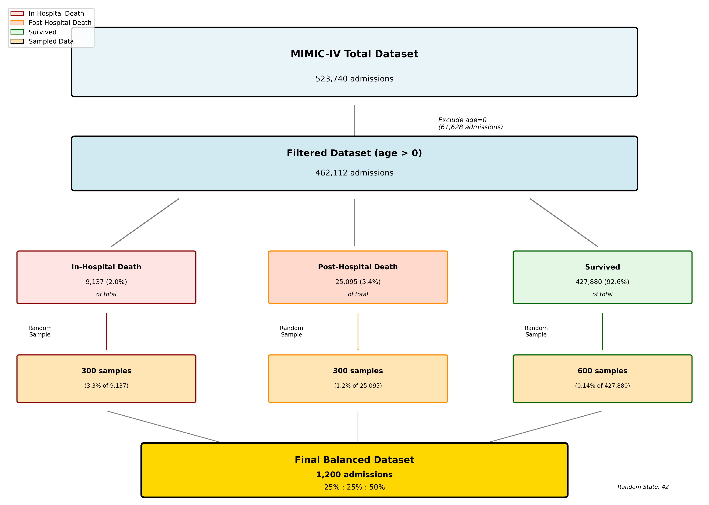

# MIMIC-IV 데이터 샘플링 방법론

## 📌 개요
MIMIC-IV 데이터셋에서 사망률 예측 연구를 위한 균형잡힌 1,200건의 admission 샘플을 추출합니다.
병원 내 사망, 병원 후 사망, 생존 데이터를 균형있게 포함하여 다양한 예후 예측 모델 개발에 활용할 수 있습니다.

## 🎯 샘플링 목표
- 목표 1: 균형잡힌 사망률 데이터셋 구축 (병원내/병원후/생존)
- 목표 2: 통계적 대표성을 갖춘 1,200건 샘플 추출
- 목표 3: 재현 가능한 샘플링 방법론 확립

## 📊 샘플링 전략

### 샘플링 Flow Diagram

*그림 1: MIMIC-IV 전체 데이터셋(523,740건)에서 균형잡힌 샘플(1,200건) 추출 과정*

### 전체 데이터셋 vs 샘플 비교
| 구분 | 전체 데이터셋 (0세 제외) | 샘플 데이터셋 | 샘플링 비율 |
|------|------------------------|--------------|------------|
| **총 입원 건수** | 462,112건 (100%) | 1,200건 (100%) | 0.26% |
| **병원 내 사망** | 9,137건 (2.0%) | 300건 (25%) | 3.3% |
| **병원 후 사망** | 25,095건 (5.4%) | 300건 (25%) | 1.2% |
| **생존** | 427,880건 (92.6%) | 600건 (50%) | 0.14% |

#### 주요 특징
- **원본 데이터의 불균형**: 생존 92.6%, 사망 7.4%의 극심한 불균형
- **샘플의 균형화**: 사망(50%) : 생존(50%)의 균형잡힌 비율
- **사망 세분화**: 병원 내 사망과 병원 후 사망을 동일 비율로 샘플링

### 데이터 구성 (총 1,200건)
| 그룹 | 정의 | 샘플 수 | 비율 |
|------|------|---------|------|
| 병원 내 사망 | hospital_expire_flag = 1 | 300 | 25% |
| 병원 후 사망 | hospital_expire_flag = 0 & dod is not null | 300 | 25% |
| 생존 | dod is null | 600 | 50% |

### 제외 기준
- 0세 환자 (anchor_age = 0): 61,628건 제외
- 신생아의 특수한 생리학적 특성으로 인한 제외

## 🔧 주요 코드 설명

### 데이터 분류 로직 (scripts/analysis/perform_sampling_test.py:54-67)
```python
# 병원 내 사망
in_hospital_death = df[df['hospital_expire_flag'] == 1]

# 병원 후 사망  
post_hospital_death = df[(df['hospital_expire_flag'] == 0) & 
                         (df['dod'].notna())]

# 생존
survived = df[df['dod'].isna()]
```

### 랜덤 샘플링 (scripts/analysis/perform_sampling_test.py:73-90)
random_state=42를 사용하여 재현 가능한 샘플링을 수행합니다.

## 🚀 실행 방법

### 필요한 도구
- Python 3.8 이상
- pandas, numpy

### 실행 명령
```bash
# 프로젝트 루트에서
source .venv/bin/activate
cd analysis_samplingmethod
python scripts/analysis/perform_sampling_test.py
```

## 📈 샘플링 결과

### 최종 샘플 구성
- **총 샘플**: 1,200건
- **고유 환자**: 1,171명
- **병원 내 사망**: 300건 (실제 가능: 9,137건 중)
- **병원 후 사망**: 300건 (실제 가능: 25,095건 중)
- **생존**: 600건 (실제 가능: 427,880건 중)

### 추출된 데이터

#### Core 테이블
| 테이블 | 행 수 | 설명 |
|--------|-------|------|
| admissions_sampled.csv | 1,200 | 샘플된 입원 정보 |
| patients_sampled.csv | 1,171 | 관련 환자 정보 |
| transfers_sampled.csv | 4,682 | 병동 이동 정보 |

## 📁 데이터 저장 위치

### 샘플 데이터
```
processed_data/
├── core/
│   ├── admissions_sampled.csv
│   ├── patients_sampled.csv
│   └── transfers_sampled.csv
├── hosp/
│   └── [향후 추가 예정]
└── icu/
    └── [향후 추가 예정]
```

### 메타데이터
```
analysis_samplingmethod/data/
├── sampled_ids.csv         # 샘플된 ID 목록
└── sampling_results.json   # 샘플링 통계
```

## ❓ 자주 묻는 질문

**Q: 왜 병원 내 사망과 병원 후 사망을 구분하나요?**
A: MIMIC-IV v2.0부터 CDC에서 구매한 주 사망 기록이 추가되어, 퇴원 후 1년 이내 사망 데이터를 활용할 수 있습니다. 이는 단기/장기 예후를 모두 고려한 모델 개발에 중요합니다.

**Q: 샘플 크기 1,200건의 근거는?**
A: 사망률 예측 모델 개발을 위한 최소한의 균형 데이터셋으로, 각 그룹당 충분한 샘플을 확보하면서도 처리 가능한 크기입니다.

**Q: 재현 가능한가요?**
A: random_state=42를 사용하여 동일한 샘플을 재현할 수 있습니다.

## 🔗 관련 분석
- [Demographic Analysis](../analysis_demographic/README.md)
- [MIMIC-IV 공식 문서](https://mimic.mit.edu/docs/iv/)

## 📚 참고 문헌
- MIT-LCP GitHub Issues #190, #1199, #1411 (병원내/외 사망 구분)
- MIMIC-IV v2.0 Release Notes (CDC 사망 기록 추가)