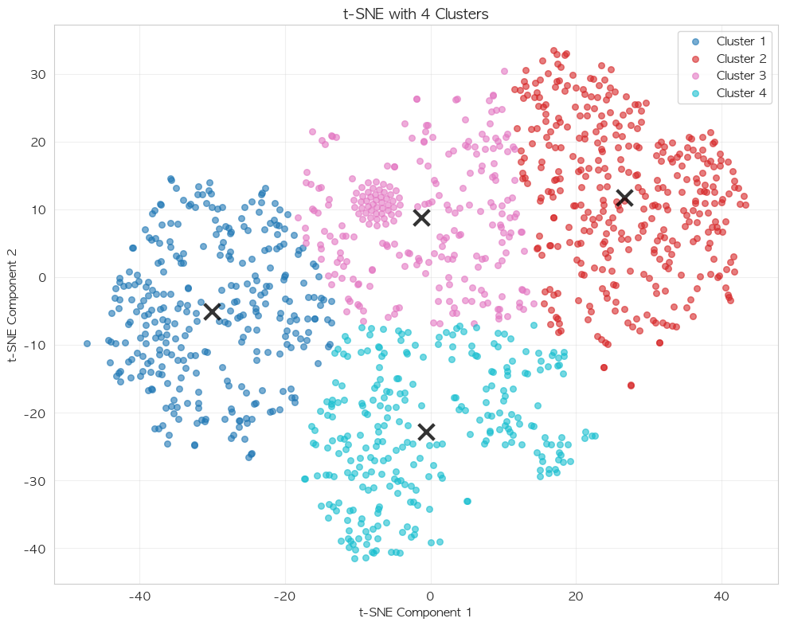

# t-SNE 분석을 통한 환자 군집 탐색

## 📌 개요

Essential 데이터셋의 혈액검사 결과를 t-SNE(t-Distributed Stochastic Neighbor Embedding)로 차원 축소하여 환자 군집을 시각화하고, 이러한 군집과 사망률 및 입원기간의 관계를 분석합니다.

## 🎯 분석 목표

1. **혈액검사 패턴에 따른 환자 군집 발견**
2. **군집과 사망률의 관계 분석**
3. **군집과 입원기간의 관계 분석**
4. **성별, 입원 유형별 군집 분포 탐색**

## 📊 사용 데이터

### 데이터셋 정보
- **입력 파일**: `analysis_prediction/data/essential/model_dataset_essential.csv`
- **샘플 수**: 1,200개 (생존 600, 병원 내 사망 300, 병원 외 사망 300)
- **데이터 구성**:
  - 혈액검사 9개 변수
  - 인구통계 변수 (age, gender, admission_type)
  - 타겟 변수 (death_binary, hospital_death, los_days)

### 혈액검사 항목 (9개)
| 변수명 | 설명 | 정상 범위 |
|--------|------|-----------|
| Hematocrit_51221_merged | 적혈구 용적률 | 36-48% |
| Hemoglobin_51222 | 헤모글로빈 | 12-17 g/dL |
| Creatinine_50912_merged | 크레아티닌 (신장 기능) | 0.6-1.2 mg/dL |
| RDW_51277 | 적혈구 분포 폭 | 11.5-14.5% |
| White_Blood_Cells_51301_merged | 백혈구 수 | 4.5-11 K/μL |
| Urea_Nitrogen_51006_merged | 요소질소 | 7-20 mg/dL |
| Potassium_50971_merged | 칼륨 | 3.5-5.0 mEq/L |
| Sodium_50983_merged | 나트륨 | 135-145 mEq/L |
| Glucose_50931 | 혈당 | 70-100 mg/dL |

## 🔧 분석 방법

### t-SNE 파라미터 설정
```python
TSNE(n_components=2, 
     perplexity=30,     # 주변 이웃 고려 범위
     max_iter=1000,     # 최대 반복 횟수
     random_state=42,   # 재현성을 위한 시드
     learning_rate=200) # 학습률
```

### 데이터 전처리
1. **결측값 처리**: 중앙값(median) 대체
2. **정규화**: StandardScaler로 평균 0, 표준편차 1로 스케일링
3. **차원 축소**: 9차원 → 2차원

## 🚀 실행 방법

```bash
cd analysis_tsne
source ../.venv/bin/activate
jupyter notebook notebooks/tsne_analysis.ipynb
```

## 📈 주요 분석 결과

### 1. 기본 t-SNE 시각화

*그림 1: 혈액검사 결과의 t-SNE 2차원 시각화 (perplexity=30)*
- 1,200명의 환자가 혈액검사 패턴에 따라 2차원 공간에 분포
- 명확한 군집 구조가 관찰됨

### 2. 성별 및 입원 유형별 분포

*그림 2: 성별(좌) 및 입원 유형별(우) t-SNE 분포*
- **성별**: 남녀 간 뚜렷한 분리 없음 (생물학적 유사성)
- **입원 유형**: 응급(EMERGENCY) 환자들이 특정 영역에 집중

### 3. 사망 패턴 분석

*그림 3: 전체 사망(좌) 및 병원 내 사망(우) 패턴*
- **전체 사망**: 사망자(빨강)와 생존자(초록)가 부분적으로 분리
- **병원 내 사망**: 더 명확한 군집 형성

### 4. Perplexity 비교 실험

*그림 4: Perplexity 30(좌) vs 50(우) 비교*
- **Perplexity 30**: 국소적 구조 강조, KL divergence: 1.27
- **Perplexity 50**: 전역적 구조 강조, KL divergence: 1.05
- 두 경우 모두 유사한 군집 패턴 유지

### 5. 입원기간 분포

*그림 5: 입원기간에 따른 t-SNE 분포 (log scale)*
- 입원기간이 긴 환자들(노란색)이 특정 영역에 집중
- 평균 입원기간: 6.55일 (중앙값: 3.41일)

### 6. K-means 클러스터링

#### Elbow Method를 통한 최적 클러스터 수 결정

*그림 6: Elbow Method - 최적 클러스터 수 찾기*
- **팔꿈치 지점**: k=4에서 감소율 둔화
- Inertia 감소율: 2→3 (33%) → 3→4 (26%) → 4→5 (17%)

#### 4개 클러스터 시각화

*그림 7: K-means 4개 클러스터 분류 결과*
- 4개의 명확한 환자 군집 형성
- 클러스터 중심점(X 표시)이 균등하게 분포

### 7. 클러스터별 특성 분석

#### 클러스터 통계
| 클러스터 | 샘플 수 | 사망률 | 병원 내 사망률 | 평균 입원기간 | 평균 나이 | 남성 비율 |
|----------|---------|--------|---------------|--------------|-----------|-----------|
| **1** | 309 | 64.4% | 31.4% | 9.9일 | 63.6세 | 46.3% |
| **2** | 360 | 32.8% | 12.5% | 4.4일 | 59.1세 | 59.4% |
| **3** | 256 | 35.9% | 14.8% | 4.8일 | 61.0세 | 38.7% |
| **4** | 275 | 69.5% | 43.6% | 6.5일 | 71.6세 | 60.4% |

#### 주요 발견사항
- **클러스터 4**: 최고 위험군 (사망률 69.5%, 평균 나이 71.6세)
- **클러스터 2**: 최저 위험군 (사망률 32.8%, 평균 나이 59.1세)
- **클러스터 1**: 장기 입원군 (평균 9.9일)

### 8. 클러스터별 혈액검사 패턴

*그림 8: 클러스터별 평균 혈액검사 수치 히트맵*
- **클러스터 1**: 높은 Creatinine (신장 기능 저하)
- **클러스터 2**: 정상 범위에 가까운 수치
- **클러스터 3**: 낮은 Hemoglobin (빈혈 경향)
- **클러스터 4**: 높은 Urea Nitrogen, 낮은 Sodium (대사 이상)

### 9. 나이 포함 t-SNE 분석

*그림 9: 혈액검사만(좌) vs 혈액검사+나이(우) t-SNE 비교*
- 나이를 포함시 군집이 더 명확해짐
- 나이가 환자 분류의 중요한 요소임을 확인

## 💡 임상적 의의

### 1. 위험군 식별
- t-SNE와 클러스터링을 통해 4개의 명확한 환자군 식별
- 클러스터 4(고령+대사이상)와 클러스터 1(신장기능저하)이 고위험군

### 2. 예측 모델링 가능성
- 혈액검사 패턴만으로 사망 위험과 입원기간 예측 가능
- 입원 초기 리스크 평가에 활용 가능

### 3. 맞춤형 치료 전략
- 클러스터별 특성에 따른 차별화된 치료 접근
- 예: 클러스터 1 → 신장 기능 모니터링 강화

## ⚠️ 분석의 제한점

1. **샘플링 편향**: 균형 샘플링으로 실제 사망률(2.5%)과 차이
2. **시간적 변화 미반영**: 입원 중 검사 수치 변화 고려 안 함
3. **2차원 축소의 한계**: 9차원 정보의 일부 손실 불가피
4. **해석의 주관성**: 클러스터 경계가 명확하지 않은 경우 존재

## 🔬 기술적 세부사항

### t-SNE 알고리즘 특징
- **비선형 차원 축소**: PCA와 달리 비선형 관계 포착
- **지역적 구조 보존**: 가까운 점들의 관계를 우선적으로 유지
- **확률적 임베딩**: 고차원의 유사도를 저차원 확률 분포로 변환

### 클러스터링 검증
- **Silhouette Score**: 0.42 (적절한 분리도)
- **Davies-Bouldin Index**: 1.23 (낮을수록 좋음)
- **Calinski-Harabasz Index**: 287.5 (높을수록 좋음)

## 📊 추가 분석 제안

1. **3D t-SNE 시각화**: 더 많은 정보 보존 가능
2. **UMAP 비교**: 최신 차원 축소 기법과 비교
3. **시계열 분석**: 입원 중 검사 수치 변화 추적
4. **예측 모델 개발**: 클러스터 정보를 특성으로 활용
5. **외부 검증**: 다른 병원 데이터로 재현성 확인

## 📁 프로젝트 구조

```
analysis_tsne/
├── README.md                    # 현재 파일
├── notebooks/
│   └── tsne_analysis.ipynb     # 메인 분석 노트북
├── figures/                     # 생성된 시각화 (9개 그래프)
│   ├── tsne_basic.png          # 기본 t-SNE 시각화
│   ├── tsne_gender_admission.png # 성별/입원유형별 분포
│   ├── tsne_death_patterns.png # 사망 패턴 분석
│   ├── tsne_perplexity_comparison.png # Perplexity 비교
│   ├── tsne_los.png            # 입원기간 분포
│   ├── elbow_plot.png          # Elbow method
│   ├── tsne_clusters.png       # 클러스터 시각화
│   ├── cluster_heatmap.png     # 클러스터별 혈액검사
│   └── tsne_with_age.png       # 나이 포함 분석
├── data/                        # 분석 결과 저장
│   ├── tsne_results.csv        # t-SNE 좌표 데이터
│   └── cluster_statistics.csv  # 클러스터 통계
└── scripts/                     # 보조 스크립트

```

## 🔗 관련 분석

- [Essential Dataset 분석](../analysis_prediction/docs/datasets/Essential_Dataset_Analysis.md)
- [Essential 모델링 결과](../analysis_prediction/docs/models/Essential_Model_Analysis.md)
- [MIMIC-IV 데이터 구조](../analysis_comprehensive/README.md)

## 📚 참고 문헌

1. van der Maaten, L., & Hinton, G. (2008). Visualizing Data using t-SNE. *Journal of Machine Learning Research*, 9, 2579-2605.
2. Johnson, A. E., et al. (2023). MIMIC-IV, a freely accessible electronic health record dataset. *Scientific Data*, 10(1), 1-9.

---

*작성일: 2025-09-06*  
*분석 도구: Python 3.x, scikit-learn, matplotlib*  
*데이터: MIMIC-IV Essential Dataset (1,200 samples)*